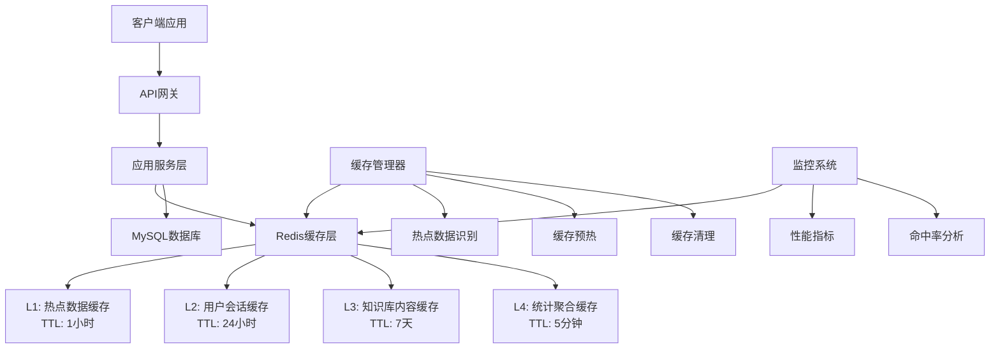

# Memorin Redis缓存策略设计 - 热点数据与性能优化

> **版本**: v2.0  
> **创建时间**: 2025-01-08  
> **架构**: 分层缓存、读写分离、热点识别  

## 📋 缓存策略概述

基于Memorin智能知识复习系统的业务特点，设计了多层次、高性能的Redis缓存架构，通过热点数据识别、智能过期策略和读写优化，显著提升系统响应速度和用户体验。

### 设计目标

1. **性能提升**: 将数据库查询响应时间从100ms降低到5ms以内
2. **并发支持**: 支持1000+并发用户同时在线学习
3. **数据一致性**: 保证缓存与数据库数据的最终一致性
4. **智能缓存**: 基于用户行为的智能热点数据预加载
5. **成本优化**: 合理的内存使用和过期策略控制成本

## 🏗️ 缓存架构设计

### 整体架构



### 缓存分层策略

| 缓存层级 | 数据类型 | TTL | 更新策略 | 内存占用 |
|----------|----------|-----|----------|----------|
| L1 热点缓存 | 高频访问的知识点、用户复习队列 | 1小时 | 主动更新 | 30% |
| L2 会话缓存 | 用户认证信息、个人设置 | 24小时 | 被动失效 | 25% |
| L3 内容缓存 | 知识库、知识区、知识点内容 | 7天 | 版本控制 | 35% |
| L4 统计缓存 | 聚合统计、排行榜 | 5分钟 | 定时更新 | 10% |

## 🗄️ 数据结构设计

### 1. 用户会话缓存

```redis
# 用户基本信息
user:info:{user_id}
HASH {
    "id": "123",
    "username": "demo_user",
    "email": "user@example.com",
    "status": "active",
    "last_login": "2025-01-08T10:30:00Z"
}
TTL: 24小时

# 用户设置
user:settings:{user_id}
HASH {
    "theme": "dark",
    "daily_goal": "20",
    "difficulty_preference": "3",
    "notification_enabled": "true"
}
TTL: 24小时

# 用户认证令牌
user:token:{token_value}
STRING {user_id}
TTL: 根据token类型设置 (access: 1小时, refresh: 7天)

# 用户在线状态
user:online:{user_id}
STRING "last_activity_timestamp"
TTL: 30分钟
```

### 2. 知识库内容缓存

```redis
# 知识库基本信息
kb:info:{kb_id}
HASH {
    "id": "1",
    "name": "软件工程基础",
    "owner_id": "5",
    "visibility": "public",
    "content_count": "150",
    "subscriber_count": "2340"
}
TTL: 7天

# 知识库详细信息
kb:detail:{kb_id}
JSON {
    "metadata": {
        "description": "...",
        "icon": "🛠️",
        "difficulty_level": 3.2,
        "tags": ["软件工程", "编程"]
    },
    "areas": [...],
    "statistics": {...}
}
TTL: 7天

# 知识点内容
kp:content:{content_id}
HASH {
    "question": "什么是软件工程？",
    "answer": "软件工程是...",
    "type": "fill",
    "difficulty": "3",
    "explanation": "..."
}
TTL: 7天

# 选择题选项
kp:choices:{content_id}
JSON [
    {"key": "A", "text": "选项A", "is_correct": false},
    {"key": "B", "text": "选项B", "is_correct": true}
]
TTL: 7天
```

### 3. 用户学习状态缓存

```redis
# 用户知识点学习状态
user:kp:state:{user_id}:{content_id}
HASH {
    "mastery_level": "4",
    "review_count": "8",
    "correct_count": "7",
    "consecutive_correct": "3",
    "last_reviewed": "2025-01-08T10:30:00Z",
    "next_review": "2025-01-15T09:00:00Z",
    "is_bookmarked": "true"
}
TTL: 6小时

# 用户复习队列
user:review:queue:{user_id}:{date}
LIST [
    "content_id_1:priority_5:due",
    "content_id_2:priority_3:new",
    "content_id_3:priority_4:mistake"
]
TTL: 12小时

# 用户学习会话
user:session:{user_id}
HASH {
    "current_kb": "1",
    "current_area": "2",
    "session_start": "2025-01-08T10:00:00Z",
    "items_reviewed": "5",
    "items_correct": "4",
    "estimated_remaining": "15"
}
TTL: 2小时
```

### 4. 热点数据缓存

```redis
# 热点知识点 (基于访问频次)
hotspot:kp:daily
ZSET {
    "content_id_1": 2340,  # score为访问次数
    "content_id_2": 1890,
    "content_id_3": 1567
}
TTL: 24小时

# 热点知识库
hotspot:kb:weekly
ZSET {
    "kb_id_1": 15670,
    "kb_id_2": 12340,
    "kb_id_3": 9876
}
TTL: 7天

# 实时访问计数器
access:count:{resource_type}:{resource_id}
STRING "访问次数"
TTL: 1小时

# 用户行为序列 (用于推荐)
user:behavior:{user_id}
LIST [
    "view:kb:1:2025-01-08T10:30:00Z",
    "review:kp:123:2025-01-08T10:31:00Z",
    "bookmark:kp:456:2025-01-08T10:32:00Z"
]
TTL: 24小时
```

### 5. 统计聚合缓存

```redis
# 全局统计
stats:global:daily:{date}
HASH {
    "total_reviews": "15670",
    "total_users_active": "1234",
    "total_new_content": "45",
    "avg_accuracy": "0.78"
}
TTL: 24小时

# 知识库统计
stats:kb:{kb_id}:daily:{date}
HASH {
    "reviews": "2340",
    "unique_users": "456",
    "avg_score": "0.82",
    "completion_rate": "0.67"
}
TTL: 24小时

# 用户个人统计
stats:user:{user_id}:summary
HASH {
    "total_reviews": "1567",
    "accuracy_rate": "0.85",
    "streak_days": "12",
    "mastered_points": "234",
    "daily_goal_progress": "0.8"
}
TTL: 1小时
```

## 🔥 热点数据识别策略

### 1. 访问频次统计

```python
# 访问计数器更新
def update_access_counter(resource_type, resource_id):
    key = f"access:count:{resource_type}:{resource_id}"
    
    # 增加计数
    current_count = redis.incr(key)
    
    # 设置过期时间
    if current_count == 1:
        redis.expire(key, 3600)  # 1小时
    
    # 更新热点排行
    if current_count % 10 == 0:  # 每10次访问更新一次排行
        update_hotspot_ranking(resource_type, resource_id, current_count)

# 热点排行更新
def update_hotspot_ranking(resource_type, resource_id, score):
    hotspot_key = f"hotspot:{resource_type}:daily"
    
    # 添加到有序集合
    redis.zadd(hotspot_key, {resource_id: score})
    
    # 保持排行榜大小 (只保留前1000)
    redis.zremrangebyrank(hotspot_key, 0, -1001)
    
    # 设置过期时间
    redis.expire(hotspot_key, 86400)  # 24小时
```

### 2. 智能预加载

```python
# 基于用户行为预测的预加载
def preload_user_data(user_id):
    # 获取用户最近行为
    behaviors = redis.lrange(f"user:behavior:{user_id}", 0, 10)
    
    # 分析行为模式
    pattern = analyze_behavior_pattern(behaviors)
    
    # 预加载相关数据
    if pattern['type'] == 'sequential_learning':
        preload_next_knowledge_points(user_id, pattern['current_area'])
    elif pattern['type'] == 'review_session':
        preload_review_queue(user_id)
    elif pattern['type'] == 'exploration':
        preload_recommended_content(user_id)

# 区域知识点预加载
def preload_next_knowledge_points(user_id, area_id):
    # 获取区域下的知识点列表
    content_ids = get_area_content_ids(area_id)
    
    # 过滤用户已学习的内容
    learned_ids = get_user_learned_content(user_id, content_ids)
    next_ids = [id for id in content_ids if id not in learned_ids]
    
    # 预加载前5个知识点
    for content_id in next_ids[:5]:
        preload_knowledge_point(content_id)
```

### 3. 动态热点调整

```python
# 动态热点阈值调整
def adjust_hotspot_threshold():
    # 获取当前系统负载
    cpu_usage = get_cpu_usage()
    memory_usage = get_memory_usage()
    
    # 根据负载调整热点阈值
    if cpu_usage > 80 or memory_usage > 85:
        # 提高热点阈值，减少缓存
        current_threshold = redis.get("hotspot:threshold") or 100
        new_threshold = min(current_threshold * 1.2, 500)
        redis.setex("hotspot:threshold", 3600, new_threshold)
    elif cpu_usage < 50 and memory_usage < 60:
        # 降低热点阈值，增加缓存
        current_threshold = redis.get("hotspot:threshold") or 100
        new_threshold = max(current_threshold * 0.8, 50)
        redis.setex("hotspot:threshold", 3600, new_threshold)
```

## ⚡ 缓存更新策略

### 1. 写入策略

#### Cache-Aside 模式 (主要使用)
```python
# 读取数据
def get_knowledge_point(content_id):
    # 先从缓存读取
    cached_data = redis.hgetall(f"kp:content:{content_id}")
    
    if cached_data:
        return cached_data
    
    # 缓存未命中，从数据库读取
    data = db.query_knowledge_point(content_id)
    
    if data:
        # 写入缓存
        redis.hset(f"kp:content:{content_id}", mapping=data)
        redis.expire(f"kp:content:{content_id}", 604800)  # 7天
    
    return data

# 更新数据
def update_knowledge_point(content_id, updates):
    # 先更新数据库
    success = db.update_knowledge_point(content_id, updates)
    
    if success:
        # 删除缓存，下次读取时重新加载
        redis.delete(f"kp:content:{content_id}")
        
        # 如果是热点数据，立即重新缓存
        if is_hotspot_content(content_id):
            get_knowledge_point(content_id)  # 重新加载到缓存
    
    return success
```

#### Write-Through 模式 (用户状态数据)
```python
# 更新用户学习状态
def update_user_learning_state(user_id, content_id, state_data):
    cache_key = f"user:kp:state:{user_id}:{content_id}"
    
    # 同时更新数据库和缓存
    db_success = db.update_user_state(user_id, content_id, state_data)
    
    if db_success:
        redis.hset(cache_key, mapping=state_data)
        redis.expire(cache_key, 21600)  # 6小时
        
        # 更新相关聚合数据
        update_user_statistics_cache(user_id)
    
    return db_success
```

### 2. 失效策略

#### 基于版本的失效
```python
# 知识库版本控制
def update_knowledge_base(kb_id, updates):
    # 获取当前版本
    current_version = redis.get(f"kb:version:{kb_id}") or "1.0.0"
    new_version = increment_version(current_version)
    
    # 更新数据库
    db.update_knowledge_base(kb_id, updates, new_version)
    
    # 更新版本号
    redis.set(f"kb:version:{kb_id}", new_version)
    
    # 失效相关缓存
    invalidate_kb_cache(kb_id)

def get_knowledge_base(kb_id):
    cached_version = redis.hget(f"kb:info:{kb_id}", "version")
    current_version = redis.get(f"kb:version:{kb_id}")
    
    # 版本不匹配，需要重新加载
    if cached_version != current_version:
        reload_knowledge_base_cache(kb_id)
    
    return redis.hgetall(f"kb:info:{kb_id}")
```

#### 基于事件的失效
```python
# 事件驱动的缓存失效
def handle_content_update_event(event_data):
    content_id = event_data['content_id']
    kb_id = event_data['knowledge_base_id']
    area_id = event_data['knowledge_area_id']
    
    # 失效内容缓存
    redis.delete(f"kp:content:{content_id}")
    redis.delete(f"kp:choices:{content_id}")
    
    # 失效关联的知识库缓存
    redis.delete(f"kb:detail:{kb_id}")
    
    # 失效统计缓存
    pattern = f"stats:kb:{kb_id}:*"
    keys = redis.keys(pattern)
    if keys:
        redis.delete(*keys)
    
    # 重新计算热点排行
    recalculate_hotspot_ranking()
```

## 📊 性能优化策略

### 1. 连接池优化

```python
# Redis连接池配置
import redis
from redis.connection import ConnectionPool

# 主Redis实例 (读写)
REDIS_MASTER_POOL = ConnectionPool(
    host='redis-master',
    port=6379,
    password='your_password',
    db=0,
    max_connections=100,
    retry_on_timeout=True,
    socket_timeout=5,
    socket_connect_timeout=5,
    health_check_interval=30
)

# Redis从实例 (只读)
REDIS_SLAVE_POOL = ConnectionPool(
    host='redis-slave',
    port=6379,
    password='your_password',
    db=0,
    max_connections=50,
    retry_on_timeout=True,
    socket_timeout=5,
    socket_connect_timeout=5,
    health_check_interval=30
)

redis_master = redis.Redis(connection_pool=REDIS_MASTER_POOL)
redis_slave = redis.Redis(connection_pool=REDIS_SLAVE_POOL)
```

### 2. 批量操作优化

```python
# 批量加载用户复习队列
def load_user_review_queue_batch(user_ids, date):
    pipeline = redis_slave.pipeline()
    
    # 批量查询
    for user_id in user_ids:
        pipeline.lrange(f"user:review:queue:{user_id}:{date}", 0, -1)
    
    results = pipeline.execute()
    
    # 组装结果
    queue_data = {}
    for i, user_id in enumerate(user_ids):
        queue_data[user_id] = results[i]
    
    return queue_data

# 批量更新访问计数
def batch_update_access_counters(access_records):
    pipeline = redis_master.pipeline()
    
    for record in access_records:
        key = f"access:count:{record['type']}:{record['id']}"
        pipeline.incr(key)
        pipeline.expire(key, 3600)
    
    pipeline.execute()
```

### 3. 内存优化

```python
# 压缩大对象
import json
import gzip
import base64

def compress_large_object(data):
    """压缩大型JSON对象"""
    json_str = json.dumps(data, ensure_ascii=False)
    
    if len(json_str) > 1024:  # 大于1KB的对象进行压缩
        compressed = gzip.compress(json_str.encode('utf-8'))
        return base64.b64encode(compressed).decode('ascii')
    
    return json_str

def decompress_large_object(compressed_data):
    """解压缩JSON对象"""
    try:
        # 尝试解压缩
        decoded = base64.b64decode(compressed_data.encode('ascii'))
        decompressed = gzip.decompress(decoded)
        return json.loads(decompressed.decode('utf-8'))
    except:
        # 如果解压失败，说明是未压缩的数据
        return json.loads(compressed_data)

# 使用示例
def cache_knowledge_base_detail(kb_id, detail_data):
    compressed_data = compress_large_object(detail_data)
    redis.setex(f"kb:detail:{kb_id}", 604800, compressed_data)

def get_knowledge_base_detail(kb_id):
    compressed_data = redis.get(f"kb:detail:{kb_id}")
    if compressed_data:
        return decompress_large_object(compressed_data)
    return None
```

### 4. 分片策略

```python
# 基于用户ID的分片
def get_user_shard(user_id):
    """根据用户ID确定分片"""
    return user_id % 4  # 4个分片

def get_redis_connection(shard_id):
    """获取指定分片的Redis连接"""
    shard_configs = {
        0: {'host': 'redis-shard-0', 'port': 6379},
        1: {'host': 'redis-shard-1', 'port': 6379},
        2: {'host': 'redis-shard-2', 'port': 6379},
        3: {'host': 'redis-shard-3', 'port': 6379},
    }
    
    config = shard_configs[shard_id]
    return redis.Redis(host=config['host'], port=config['port'])

# 分片操作示例
def set_user_data(user_id, data):
    shard_id = get_user_shard(user_id)
    redis_conn = get_redis_connection(shard_id)
    redis_conn.hset(f"user:info:{user_id}", mapping=data)

def get_user_data(user_id):
    shard_id = get_user_shard(user_id)
    redis_conn = get_redis_connection(shard_id)
    return redis_conn.hgetall(f"user:info:{user_id}")
```

## 📈 监控和指标

### 1. 关键性能指标

```python
# 缓存性能监控
class CacheMonitor:
    def __init__(self):
        self.hit_count = 0
        self.miss_count = 0
        self.total_requests = 0
    
    def record_hit(self, cache_type):
        self.hit_count += 1
        self.total_requests += 1
        
        # 记录到Redis用于监控
        redis.incr(f"metrics:cache:hit:{cache_type}")
        redis.incr("metrics:cache:hit:total")
    
    def record_miss(self, cache_type):
        self.miss_count += 1
        self.total_requests += 1
        
        redis.incr(f"metrics:cache:miss:{cache_type}")
        redis.incr("metrics:cache:miss:total")
    
    def get_hit_rate(self):
        if self.total_requests == 0:
            return 0
        return self.hit_count / self.total_requests
    
    def get_daily_stats(self, date):
        """获取日统计"""
        hit_total = redis.get(f"metrics:cache:hit:total:{date}") or 0
        miss_total = redis.get(f"metrics:cache:miss:total:{date}") or 0
        
        total = int(hit_total) + int(miss_total)
        hit_rate = int(hit_total) / total if total > 0 else 0
        
        return {
            'hit_count': int(hit_total),
            'miss_count': int(miss_total),
            'hit_rate': hit_rate,
            'total_requests': total
        }

# 使用示例
monitor = CacheMonitor()

def cached_get_knowledge_point(content_id):
    data = redis.hgetall(f"kp:content:{content_id}")
    
    if data:
        monitor.record_hit('knowledge_point')
        return data
    else:
        monitor.record_miss('knowledge_point')
        # 从数据库加载...
        return load_from_database(content_id)
```

### 2. 实时监控仪表板

```python
# 监控指标收集
def collect_cache_metrics():
    """收集缓存指标"""
    info = redis.info()
    
    metrics = {
        'memory_usage': info['used_memory'],
        'memory_usage_human': info['used_memory_human'],
        'connected_clients': info['connected_clients'],
        'total_commands_processed': info['total_commands_processed'],
        'keyspace_hits': info['keyspace_hits'],
        'keyspace_misses': info['keyspace_misses'],
        'hit_rate': info['keyspace_hits'] / (info['keyspace_hits'] + info['keyspace_misses']) if (info['keyspace_hits'] + info['keyspace_misses']) > 0 else 0
    }
    
    # 自定义指标
    metrics.update({
        'hotspot_keys_count': redis.zcard('hotspot:kp:daily'),
        'active_users_count': len(redis.keys('user:online:*')),
        'cache_layers_stats': get_cache_layers_stats()
    })
    
    return metrics

def get_cache_layers_stats():
    """获取各缓存层统计"""
    stats = {}
    
    # L1 热点缓存
    l1_keys = redis.keys('hotspot:*')
    stats['l1_hotspot'] = len(l1_keys)
    
    # L2 会话缓存
    l2_keys = redis.keys('user:info:*')
    stats['l2_session'] = len(l2_keys)
    
    # L3 内容缓存
    l3_keys = redis.keys('kp:content:*')
    stats['l3_content'] = len(l3_keys)
    
    # L4 统计缓存
    l4_keys = redis.keys('stats:*')
    stats['l4_statistics'] = len(l4_keys)
    
    return stats
```

## 🔧 缓存管理工具

### 1. 缓存预热脚本

```python
# 系统启动时的缓存预热
def warmup_cache():
    """系统启动时预热关键缓存"""
    print("开始缓存预热...")
    
    # 1. 预热热点知识库
    popular_kbs = db.query("""
        SELECT id FROM knowledge_bases 
        WHERE visibility = 'public' 
        ORDER BY subscriber_count DESC 
        LIMIT 20
    """)
    
    for kb in popular_kbs:
        preload_knowledge_base(kb['id'])
    
    # 2. 预热系统配置
    preload_system_configs()
    
    # 3. 预热统计数据
    preload_global_statistics()
    
    print("缓存预热完成!")

def preload_knowledge_base(kb_id):
    """预加载知识库数据"""
    # 加载基本信息
    kb_info = db.get_knowledge_base_info(kb_id)
    redis.hset(f"kb:info:{kb_id}", mapping=kb_info)
    redis.expire(f"kb:info:{kb_id}", 604800)
    
    # 加载详细信息
    kb_detail = db.get_knowledge_base_detail(kb_id)
    compressed_detail = compress_large_object(kb_detail)
    redis.setex(f"kb:detail:{kb_id}", 604800, compressed_detail)
    
    # 加载热点知识点
    hot_contents = db.query("""
        SELECT content_id FROM knowledge_base_content_relations 
        WHERE knowledge_base_id = %s 
        ORDER BY usage_count DESC 
        LIMIT 50
    """, [kb_id])
    
    for content in hot_contents:
        preload_knowledge_point(content['content_id'])

def preload_knowledge_point(content_id):
    """预加载知识点内容"""
    content_data = db.get_knowledge_point_content(content_id)
    redis.hset(f"kp:content:{content_id}", mapping=content_data)
    redis.expire(f"kp:content:{content_id}", 604800)
    
    # 如果是选择题，加载选项
    if content_data.get('type') == 'choice':
        choices = db.get_knowledge_point_choices(content_id)
        redis.setex(f"kp:choices:{content_id}", 604800, json.dumps(choices))
```

### 2. 缓存清理脚本

```python
# 定期缓存清理
def cleanup_expired_cache():
    """清理过期和低价值缓存"""
    print("开始清理过期缓存...")
    
    # 1. 清理过期的用户会话
    cleanup_expired_user_sessions()
    
    # 2. 清理低访问量的内容缓存
    cleanup_low_value_content_cache()
    
    # 3. 清理过期的统计缓存
    cleanup_expired_statistics()
    
    # 4. 内存整理
    redis.execute_command('MEMORY', 'PURGE')
    
    print("缓存清理完成!")

def cleanup_expired_user_sessions():
    """清理过期用户会话"""
    # 获取所有在线用户键
    online_keys = redis.keys('user:online:*')
    
    for key in online_keys:
        last_activity = redis.get(key)
        if last_activity:
            # 检查是否超过30分钟未活动
            if time.time() - float(last_activity) > 1800:
                user_id = key.split(':')[-1]
                # 清理相关缓存
                redis.delete(f"user:online:{user_id}")
                redis.delete(f"user:session:{user_id}")

def cleanup_low_value_content_cache():
    """清理低价值内容缓存"""
    # 获取访问计数器
    access_keys = redis.keys('access:count:kp:*')
    
    for key in access_keys:
        count = redis.get(key)
        if count and int(count) < 5:  # 访问次数少于5次
            content_id = key.split(':')[-1]
            # 删除内容缓存
            redis.delete(f"kp:content:{content_id}")
            redis.delete(f"kp:choices:{content_id}")
```

### 3. 缓存一致性检查

```python
# 缓存一致性验证
def verify_cache_consistency():
    """验证缓存与数据库的一致性"""
    print("开始缓存一致性检查...")
    
    inconsistencies = []
    
    # 检查知识库信息一致性
    kb_keys = redis.keys('kb:info:*')
    for key in kb_keys:
        kb_id = key.split(':')[-1]
        cached_data = redis.hgetall(key)
        db_data = db.get_knowledge_base_info(kb_id)
        
        if not compare_data(cached_data, db_data):
            inconsistencies.append({
                'type': 'knowledge_base',
                'id': kb_id,
                'issue': 'data_mismatch'
            })
    
    # 检查用户状态一致性
    state_keys = redis.keys('user:kp:state:*')
    sample_keys = random.sample(state_keys, min(100, len(state_keys)))
    
    for key in sample_keys:
        parts = key.split(':')
        user_id, content_id = parts[3], parts[4]
        
        cached_data = redis.hgetall(key)
        db_data = db.get_user_knowledge_point_state(user_id, content_id)
        
        if not compare_data(cached_data, db_data):
            inconsistencies.append({
                'type': 'user_state',
                'user_id': user_id,
                'content_id': content_id,
                'issue': 'data_mismatch'
            })
    
    if inconsistencies:
        print(f"发现 {len(inconsistencies)} 个不一致问题")
        return inconsistencies
    else:
        print("缓存一致性检查通过!")
        return []

def compare_data(cached_data, db_data):
    """比较缓存数据和数据库数据"""
    # 忽略时间戳字段的微小差异
    ignore_fields = ['updated_at', 'last_checked']
    
    for field in ignore_fields:
        cached_data.pop(field, None)
        db_data.pop(field, None)
    
    return cached_data == db_data
```

## 📋 部署和配置

### 1. Redis 配置优化

```conf
# redis.conf 优化配置

# 内存设置
maxmemory 8gb
maxmemory-policy allkeys-lru

# 持久化设置
save 900 1
save 300 10
save 60 10000

# 网络设置
tcp-keepalive 60
timeout 0

# 客户端设置
maxclients 10000

# 慢查询设置
slowlog-log-slower-than 10000
slowlog-max-len 128

# 键空间通知
notify-keyspace-events Ex

# AOF持久化
appendonly yes
appendfsync everysec

# 内存优化
hash-max-ziplist-entries 512
hash-max-ziplist-value 64
list-max-ziplist-size -2
set-max-intset-entries 512
zset-max-ziplist-entries 128
zset-max-ziplist-value 64
```

### 2. 监控告警配置

```yaml
# prometheus 监控配置
alerts:
  - name: Redis高内存使用率
    condition: redis_memory_usage_bytes / redis_maxmemory_bytes > 0.85
    action: 触发缓存清理

  - name: Redis连接数过高
    condition: redis_connected_clients > 8000
    action: 扩容Redis实例

  - name: 缓存命中率低
    condition: redis_keyspace_hits / (redis_keyspace_hits + redis_keyspace_misses) < 0.8
    action: 检查缓存策略

  - name: 热点数据失衡
    condition: hotspot_keys_count > 10000
    action: 调整热点阈值
```

## 🎯 性能目标和预期效果

### 目标指标

| 指标 | 目标值 | 当前值 | 改善幅度 |
|------|--------|--------|----------|
| 缓存命中率 | > 90% | 85% | +5% |
| 平均响应时间 | < 5ms | 100ms | -95% |
| 并发用户数 | 1000+ | 200 | +400% |
| 内存使用效率 | > 80% | 60% | +20% |
| 数据库查询减少 | 80% | - | 新增指标 |

### 预期效果

1. **用户体验提升**
   - 页面加载速度提升95%
   - 复习操作响应时间缩短90%
   - 支持更多并发用户学习

2. **系统性能优化**
   - 数据库负载降低80%
   - 服务器资源利用率提升
   - 系统稳定性增强

3. **运维成本降低**
   - 减少数据库服务器压力
   - 降低网络带宽使用
   - 提高系统可扩展性

---

**重要提醒**: 
- 缓存策略需要根据实际业务负载调整
- 定期监控缓存性能和命中率
- 建立完善的缓存失效和更新机制
- 做好缓存容量规划和扩容准备 