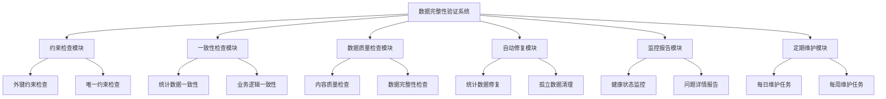

# Memorin 数据完整性验证和一致性检查系统

> **版本**: v2.0  
> **创建时间**: 2025-01-08  
> **维护者**: 数据库工程师  

## 📋 系统概述

数据完整性验证和一致性检查系统是Memorin智能知识复习系统的核心数据保障组件，通过自动化检查和修复机制，确保数据库中数据的完整性、一致性和质量。

### 设计理念

1. **预防为主**：通过约束和触发器预防数据问题
2. **主动检测**：定期自动检查数据完整性
3. **快速修复**：提供自动化修复机制
4. **详细报告**：生成详细的检查报告和修复记录
5. **性能友好**：检查过程不影响正常业务操作

## 🔧 系统架构

### 核心组件



## 📊 检查项目详解

### 1. 数据完整性约束检查

#### 1.1 外键约束检查
- **检查项目**: 所有外键关系的完整性
- **检查频率**: 每日/按需
- **存储过程**: `CheckForeignKeyIntegrity()`

```sql
-- 执行外键约束检查
CALL CheckForeignKeyIntegrity();
```

**检查内容**:
- 用户ID在相关表中的存在性
- 知识库ID、知识区ID、内容ID的关联完整性
- 订阅关系的有效性

#### 1.2 唯一约束检查
- **检查项目**: 唯一性约束违反情况
- **检查频率**: 每日
- **存储过程**: `CheckUniqueConstraintIntegrity()`

```sql
-- 执行唯一约束检查
CALL CheckUniqueConstraintIntegrity();
```

**检查内容**:
- 用户名唯一性
- 邮箱唯一性
- 知识点内容哈希唯一性

### 2. 数据一致性检查

#### 2.1 统计数据一致性
- **检查项目**: 计算字段与实际统计的一致性
- **检查频率**: 每日
- **存储过程**: `CheckStatisticsConsistency()`

```sql
-- 执行统计一致性检查
CALL CheckStatisticsConsistency();
```

**检查内容**:
- 知识库内容数量(`content_count`)与实际关联数量
- 知识库订阅者数量(`subscriber_count`)与实际订阅数量
- 知识点使用次数(`usage_count`)与实际学习记录数量
- 题目列表数量(`total_count`)与实际题目关联数量

#### 2.2 业务逻辑一致性
- **检查项目**: 业务规则的逻辑合理性
- **检查频率**: 每日
- **存储过程**: `CheckBusinessLogicConsistency()`

```sql
-- 执行业务逻辑检查
CALL CheckBusinessLogicConsistency();
```

**检查内容**:
- 正确次数不超过总复习次数
- 连续正确次数不超过总正确次数
- SM-2算法参数在合理范围内
- 复习时间逻辑正确性
- 难度等级和掌握程度在有效范围内

### 3. 数据质量检查

#### 3.1 内容质量检查
- **检查项目**: 数据内容的质量和完整性
- **检查频率**: 每周
- **存储过程**: `CheckDataQuality()`

```sql
-- 执行数据质量检查
CALL CheckDataQuality();
```

**检查内容**:
- 必填字段的完整性
- 内容长度的合理性
- 选择题选项的完整性
- 学习数据的异常值检测

#### 质量评级标准

| 评级 | 问题数量 | 描述 |
|------|----------|------|
| EXCELLENT | 0 | 无质量问题 |
| GOOD | 1-9 | 轻微质量问题 |
| FAIR | 10-49 | 中等质量问题 |
| POOR | 50+ | 严重质量问题 |

## 🔧 自动修复机制

### 1. 统计数据修复
```sql
-- 修复统计数据不一致
CALL RepairStatisticsInconsistency();
```

**修复内容**:
- 重新计算知识库内容数量
- 重新计算订阅者数量
- 重新计算知识点使用次数
- 重新计算题目列表数量

### 2. 孤立数据清理
```sql
-- 清理孤立数据
CALL CleanOrphanedData();
```

**清理内容**:
- 删除无效的用户扩展信息
- 删除过期的认证令牌
- 删除孤立的元数据记录
- 删除无效的选择题选项

## 📈 监控和报告

### 1. 实时监控视图

#### 数据完整性监控
```sql
-- 查看数据完整性状态
SELECT * FROM v_data_integrity_monitor;
```

#### 系统健康状态
```sql
-- 查看系统健康状态
SELECT * FROM v_system_health_status;
```

### 2. 综合健康检查

```sql
-- 执行综合健康检查
CALL PerformDataHealthCheck();
```

**输出信息**:
- 总体健康评分
- 各项检查结果
- 问题详情和建议

### 健康评分标准

| 评分范围 | 健康等级 | 描述 |
|----------|----------|------|
| 95-100 | EXCELLENT | 数据状态优秀 |
| 85-94 | GOOD | 数据状态良好 |
| 70-84 | FAIR | 数据状态一般 |
| 50-69 | POOR | 数据状态较差 |
| 0-49 | CRITICAL | 数据状态危险 |

## ⚙️ 定期维护

### 1. 每日维护任务

```sql
-- 执行每日维护
CALL DailyMaintenanceTasks();
```

**维护内容**:
- 清理过期令牌
- 修复统计数据不一致
- 清理临时复习队列
- 更新复习队列元数据

### 2. 每周维护任务

```sql
-- 执行每周维护
CALL WeeklyMaintenanceTasks();
```

**维护内容**:
- 清理孤立数据
- 执行完整健康检查
- 表优化（可选）

### 3. 自动化调度（可选）

如果启用了MySQL事件调度器，系统会自动执行维护任务：

```sql
-- 启用事件调度器
SET GLOBAL event_scheduler = ON;

-- 查看已创建的维护事件
SHOW EVENTS;
```

## 🚨 问题处理指南

### 1. 常见问题及解决方案

#### 外键约束违反
**问题表现**: `CheckForeignKeyIntegrity()` 返回违反记录

**解决步骤**:
1. 查看具体违反的表和记录
2. 检查是否为数据导入错误
3. 决定删除违反记录或修复关联关系
4. 重新执行检查确认修复

#### 统计数据不一致
**问题表现**: `CheckStatisticsConsistency()` 返回不一致记录

**解决步骤**:
1. 执行 `RepairStatisticsInconsistency()` 自动修复
2. 检查触发器是否正常工作
3. 如果问题持续，检查并发操作是否绕过了触发器

#### 数据质量问题
**问题表现**: `CheckDataQuality()` 返回质量问题

**解决步骤**:
1. 根据问题类型分类处理
2. 对于内容质量问题，联系内容管理员
3. 对于数据异常，调查产生原因
4. 建立预防机制避免重复出现

### 2. 紧急情况处理

#### 大量数据完整性问题
1. 立即停止相关写操作
2. 分析问题根源
3. 制定修复计划
4. 分批修复问题
5. 验证修复效果

#### 性能影响
1. 检查是否在业务高峰期执行
2. 调整检查频率
3. 考虑分批执行大型检查
4. 监控系统资源使用

## 📋 使用最佳实践

### 1. 检查频率建议

| 检查类型 | 建议频率 | 最佳执行时间 |
|----------|----------|--------------|
| 外键约束检查 | 每日 | 凌晨2:00 |
| 统计一致性检查 | 每日 | 凌晨2:30 |
| 业务逻辑检查 | 每日 | 凌晨3:00 |
| 数据质量检查 | 每周 | 周末凌晨3:30 |
| 综合健康检查 | 每周 | 周末凌晨4:00 |

### 2. 监控建议

1. **设置告警**: 当健康分数低于85时发送告警
2. **定期报告**: 每周生成健康检查报告
3. **趋势分析**: 跟踪数据质量变化趋势
4. **容量监控**: 关注数据库增长和性能

### 3. 运维建议

1. **备份策略**: 执行修复操作前做好备份
2. **权限控制**: 限制修复存储过程的执行权限
3. **日志记录**: 记录所有检查和修复操作
4. **文档更新**: 及时更新检查和修复流程

## 🔧 自定义扩展

### 1. 添加新的检查项目

```sql
-- 示例：添加自定义业务规则检查
DELIMITER $$
CREATE PROCEDURE CheckCustomBusinessRule()
BEGIN
    -- 自定义检查逻辑
    -- ...
END$$
DELIMITER ;
```

### 2. 修改检查标准

可以根据业务需求调整：
- 数据质量标准
- 健康评分算法
- 告警阈值
- 修复策略

### 3. 集成外部监控

可以将检查结果集成到：
- Prometheus + Grafana
- ELK Stack
- 自定义监控系统

## 📄 相关文档

- [数据库表结构设计文档](./数据库设计-多用户共享知识库与个人复习状态分离.md)
- [数据迁移指南](../migrations/)
- [系统部署文档](../../deploy/)

---

**重要提醒**: 
- 生产环境执行修复操作前请务必备份数据
- 定期检查系统性能影响
- 及时更新检查标准以适应业务发展 