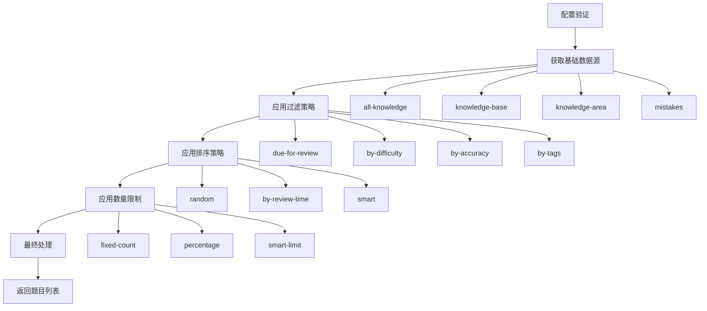
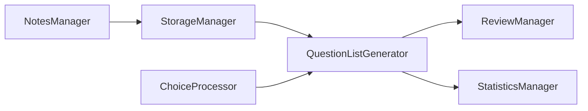

# Memorin数据结构分析报告 - question-list-generator.js

> **文件路径**: `js/question-list-generator.js`  
> **文件大小**: 671行  
> **主要职责**: 题目列表生成与智能筛选  
> **分析时间**: 2025-01-08  

## 📋 文件概述

`question-list-generator.js` 实现了高扩展性的题目列表生成器，采用策略模式设计，支持多种数据源、过滤条件、排序方式和数量限制的组合使用。这是一个核心的业务逻辑模块，为复习系统提供灵活的题目筛选和组织能力。

## 🏗️ 架构设计

### 核心设计模式

```javascript
class QuestionListGenerator {
    constructor() {
        this.strategies = new Map();    // 数据源策略
        this.filters = new Map();       // 过滤器
        this.sorters = new Map();       // 排序器
        this.limiters = new Map();      // 限制器
    }
}
```

**设计特点:**
- **策略模式**: 可插拔的数据源和处理策略
- **管道模式**: 数据流经过滤->排序->限制的管道处理
- **模板模式**: 预设配置模板简化常用场景
- **单例模式**: 通过 `window.questionListGenerator` 全局访问

### 数据处理流程



## 📊 数据源策略分析

### 1. 知识点数据源

#### all-knowledge 策略
```javascript
// 获取所有知识点
this.registerStrategy('all-knowledge', async () => {
    return window.storageManager.getAllKnowledge();
});
```

#### knowledge-base 策略
```javascript
// 按知识库筛选，包含数据修复功能
this.registerStrategy('knowledge-base', async (params) => {
    const { baseId } = params;
    const baseKnowledge = window.storageManager.getKnowledgeByBaseId(baseId);
    
    // 数据完整性验证
    const validKnowledge = baseKnowledge.filter(k => {
        if (k.knowledgeBaseId !== baseId) {
            console.warn(`知识点 ${k.id} 的归属验证失败`);
            return false;
        }
        return true;
    });
    
    return validKnowledge;
});
```

#### knowledge-area 策略
```javascript
// 按知识区筛选
this.registerStrategy('knowledge-area', async (params) => {
    const { areaId } = params;
    const allKnowledge = window.storageManager.getAllKnowledge();
    return allKnowledge.filter(k => k.areaId === areaId);
});
```

### 2. 错题数据源

#### all-mistakes 策略
```javascript
// 全部未解决错题
this.registerStrategy('all-mistakes', async () => {
    const mistakes = window.storageManager.getMistakes();
    const activeMistakes = mistakes.filter(m => !m.isResolved);
    
    return activeMistakes
        .map(mistake => window.storageManager.getKnowledgeById(mistake.knowledgeId))
        .filter(k => k);  // 过滤不存在的知识点
});
```

#### mistakes-by-base / mistakes-by-area 策略
- 按知识库或知识区获取错题
- 结合错题记录和知识点数据
- 自动过滤已解决的错题

### 3. 自定义数据源

#### custom-list 策略
```javascript
// 自定义知识点ID列表
this.registerStrategy('custom-list', async (params) => {
    const { knowledgeIds } = params;
    return knowledgeIds
        .map(id => window.storageManager.getKnowledgeById(id))
        .filter(k => k);
});
```

## 🔍 过滤器系统

### 时间过滤器
```javascript
// 到期复习过滤
this.registerFilter('due-for-review', async (questions) => {
    const now = new Date();
    return questions.filter(q => {
        const nextReview = new Date(q.nextReview);
        return nextReview <= now;
    });
});
```

### 属性过滤器
```javascript
// 难度过滤
this.registerFilter('by-difficulty', async (questions, params) => {
    const { minDifficulty, maxDifficulty } = params;
    return questions.filter(q => {
        const difficulty = q.difficulty || 3;
        return (!minDifficulty || difficulty >= minDifficulty) &&
               (!maxDifficulty || difficulty <= maxDifficulty);
    });
});

// 正确率过滤
this.registerFilter('by-accuracy', async (questions, params) => {
    const { minAccuracy, maxAccuracy } = params;
    return questions.filter(q => {
        const accuracy = q.reviewCount > 0 ? q.correctCount / q.reviewCount : 0;
        return (!minAccuracy || accuracy >= minAccuracy) &&
               (!maxAccuracy || accuracy <= maxAccuracy);
    });
});
```

### 标签和分类过滤器
```javascript
// 标签过滤（支持 'any' 和 'all' 模式）
this.registerFilter('by-tags', async (questions, params) => {
    const { tags, mode = 'any' } = params;
    return questions.filter(q => {
        if (!q.tags || q.tags.length === 0) return false;
        
        if (mode === 'all') {
            return tags.every(tag => q.tags.includes(tag));
        } else {
            return tags.some(tag => q.tags.includes(tag));
        }
    });
});
```

## 📈 排序器系统

### 智能排序算法
```javascript
// 综合智能排序
this.registerSorter('smart', async (questions) => {
    return questions.sort((a, b) => {
        const now = Date.now();
        
        // 复习紧急度 (越小越紧急)
        const urgencyA = Math.max(0, new Date(a.nextReview || 0).getTime() - now);
        const urgencyB = Math.max(0, new Date(b.nextReview || 0).getTime() - now);
        
        // 正确率 (越低越需要练习)
        const accA = a.reviewCount > 0 ? a.correctCount / a.reviewCount : 0;
        const accB = b.reviewCount > 0 ? b.correctCount / b.reviewCount : 0;
        
        // 综合分数计算
        const scoreA = urgencyA * 0.5 + (1 - accA) * 1000000 + (a.difficulty || 3) * 100000;
        const scoreB = urgencyB * 0.5 + (1 - accB) * 1000000 + (b.difficulty || 3) * 100000;
        
        return scoreA - scoreB;
    });
});
```

**智能排序考虑因素:**
1. **复习紧急度**: 基于 `nextReview` 时间
2. **掌握程度**: 基于正确率计算
3. **题目难度**: 难度系数权重
4. **综合评分**: 多因素加权计算

### 其他排序策略
- **random**: 随机打乱
- **by-review-time**: 按复习时间排序
- **by-difficulty**: 按难度排序
- **by-accuracy**: 按正确率排序
- **by-created-time**: 按创建时间排序

## 🎯 限制器系统

### 智能限制算法
```javascript
// 基于用户学习能力的智能限制
this.registerLimiter('smart-limit', async (questions, params) => {
    const stats = window.storageManager.getStatistics();
    const { baseCount = 20, maxCount = 50 } = params;
    
    // 根据用户正确率调整题目数量
    const accuracy = stats.totalReviews > 0 ? stats.correctAnswers / stats.totalReviews : 0.5;
    const adjustedCount = Math.round(baseCount * (1 + (1 - accuracy) * 0.5));
    
    const finalCount = Math.min(maxCount, Math.max(10, adjustedCount));
    return questions.slice(0, finalCount);
});
```

**智能限制特点:**
- 基于用户历史表现调整数量
- 正确率低的用户增加练习题目
- 设置最小和最大数量边界

### 其他限制策略
- **fixed-count**: 固定数量限制
- **percentage**: 百分比限制
- **time-limit**: 基于预估答题时间限制

## 🎨 配置模板系统

### QuestionListTemplates 类

```javascript
class QuestionListTemplates {
    // 知识库完整复习
    static knowledgeBaseReview(baseId, options = {}) {
        return {
            source: { type: 'knowledge-base', params: { baseId } },
            filters: options.onlyDue ? [{ type: 'due-for-review' }] : [],
            sorter: { type: options.random ? 'random' : 'smart' },
            limiter: options.limit ? { type: 'fixed-count', params: { count: options.limit } } : null
        };
    }
    
    // 智能复习
    static smartReview(options = {}) {
        const { baseId, count = 20, difficulty, tags, onlyDue = true } = options;
        // 复杂的配置组合逻辑
    }
    
    // 弱项强化复习
    static weaknessReview(options = {}) {
        return {
            filters: [
                { type: 'by-accuracy', params: { maxAccuracy: 0.7 } },  // 正确率<70%
                { type: 'by-review-count', params: { minCount: 2 } }     // 至少复习2次
            ],
            sorter: { type: 'by-accuracy', params: { order: 'asc' } }
        };
    }
}
```

### 预设模板类型
1. **knowledgeBaseReview**: 知识库完整复习
2. **knowledgeAreaReview**: 知识区复习
3. **smartReview**: 智能复习
4. **mistakeReviewByBase/Area**: 错题复习
5. **allMistakesReview**: 全部错题复习
6. **weaknessReview**: 弱项强化复习

## 🔄 最终处理机制

### 选择题打乱集成
```javascript
async applyFinalProcessing(questions, config) {
    // 1. 添加元数据
    let processedQuestions = questions.map((question, index) => ({
        ...question,
        _meta: {
            index: index,
            generatedAt: Date.now(),
            source: config.source.type,
            totalCount: questions.length
        }
    }));
    
    // 2. 应用选择题打乱处理
    if (window.ChoiceProcessor && ChoiceProcessor.config.enabled) {
        processedQuestions = ChoiceProcessor.batchShuffleChoiceQuestions(processedQuestions, {
            enabled: true,
            logSummary: true
        });
    }
    
    return processedQuestions;
}
```

**最终处理功能:**
- 添加生成元数据
- 集成选择题打乱功能
- 生成统计信息
- 日志记录

## 🎯 重构建议

### 1. 微服务拆分方案

```yaml
服务名称: question-generator-service
端口: 8084
职责范围:
  - 题目列表生成
  - 筛选策略管理
  - 智能推荐算法
  - 配置模板管理

API设计:
  POST /api/questions/generate
  GET  /api/questions/templates
  GET  /api/questions/strategies
  POST /api/questions/custom-strategy
```

### 2. 数据库设计映射

#### 题目生成配置表
```sql
-- 生成配置历史表
CREATE TABLE question_generation_configs (
    id BIGINT PRIMARY KEY AUTO_INCREMENT,
    user_id BIGINT NOT NULL,
    config_name VARCHAR(100),
    source_type VARCHAR(50) NOT NULL,
    source_params JSON,
    filters JSON,
    sorter JSON,
    limiter JSON,
    created_at TIMESTAMP DEFAULT CURRENT_TIMESTAMP,
    INDEX idx_user_configs (user_id, created_at)
);

-- 用户策略偏好表
CREATE TABLE user_strategy_preferences (
    id BIGINT PRIMARY KEY AUTO_INCREMENT,
    user_id BIGINT NOT NULL,
    strategy_type VARCHAR(50) NOT NULL,
    preference_data JSON,
    usage_count INT DEFAULT 0,
    last_used TIMESTAMP DEFAULT CURRENT_TIMESTAMP,
    UNIQUE KEY uk_user_strategy (user_id, strategy_type)
);
```

### 3. 性能优化建议

#### 缓存策略
```typescript
interface QuestionCacheService {
    // 缓存生成结果
    cacheQuestionList(configHash: string, questions: Question[]): void;
    
    // 预生成热点配置
    preGeneratePopularConfigs(userId: number): void;
    
    // 增量更新缓存
    invalidateRelatedCache(knowledgeId: string): void;
}
```

#### 算法优化
- **并行过滤**: 多个过滤条件并行执行
- **索引优化**: 为常用查询条件建立索引
- **结果缓存**: 缓存相同配置的生成结果
- **预计算**: 定时预计算热点数据

### 4. Vue组件化改造

```typescript
// 题目生成配置组件
interface QuestionGeneratorConfig {
  sourceType: 'knowledge-base' | 'knowledge-area' | 'mistakes' | 'custom';
  sourceParams: Record<string, any>;
  filters: FilterConfig[];
  sorter: SorterConfig;
  limiter: LimiterConfig;
}

// 策略选择组件
const StrategySelector = defineComponent({
  props: {
    availableStrategies: Array,
    selectedStrategy: String
  },
  emits: ['update:selectedStrategy']
});
```

## 📊 数据依赖分析

### 依赖的存储接口
1. **getAllKnowledge()**: 获取所有知识点
2. **getKnowledgeByBaseId()**: 按知识库获取知识点
3. **getKnowledgeById()**: 按ID获取知识点
4. **getMistakes()**: 获取错题记录
5. **getStatistics()**: 获取用户统计数据

### 关键配置常量
```javascript
const CONFIG_DEFAULTS = {
    DEFAULT_COUNT: 20,
    MAX_COUNT: 50,
    MIN_COUNT: 10,
    SMART_URGENCY_WEIGHT: 0.5,
    SMART_ACCURACY_WEIGHT: 1000000,
    SMART_DIFFICULTY_WEIGHT: 100000,
    WEAKNESS_ACCURACY_THRESHOLD: 0.7,
    WEAKNESS_MIN_REVIEWS: 2
};
```

## 🔍 与其他模块的关系

### 数据流关系


### 模块依赖
- **依赖**: StorageManager (数据获取)
- **集成**: ChoiceProcessor (选择题处理)
- **服务**: ReviewManager (复习会话)
- **支持**: StatisticsManager (效果统计)

---

**总结**: `question-list-generator.js` 是一个设计精良的题目生成引擎，采用了成熟的设计模式，具有很强的扩展性和灵活性。在重构时应当保持其架构优势，重点优化性能和数据处理能力。 