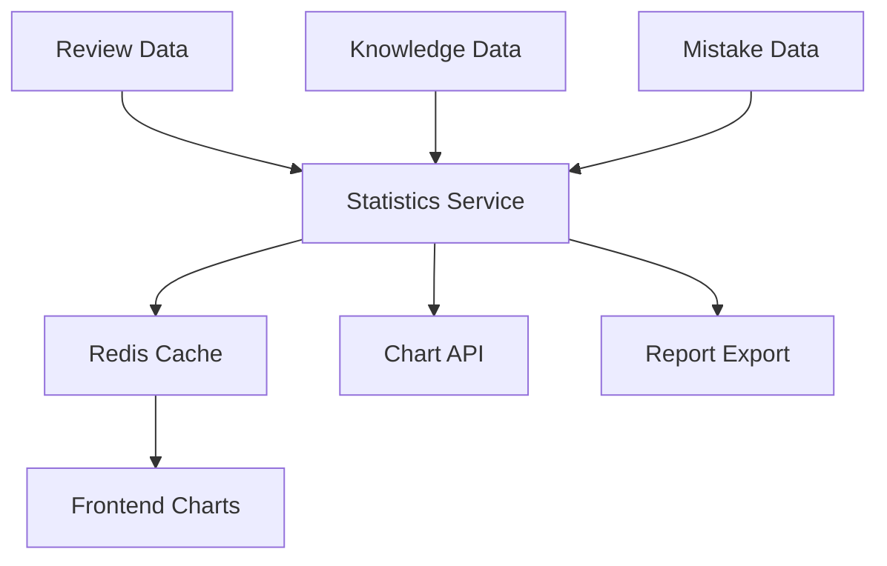

# Memorin数据结构分析报告 - statistics.js

> **文件路径**: `js/statistics.js`  
> **文件大小**: 488行  
> **主要职责**: 统计分析与数据可视化  
> **分析时间**: 2025-01-08  

## 📋 文件概述

`statistics.js` 实现了 `StatisticsManager` 类，负责学习数据的统计分析、数据可视化和报告生成。这是一个纯前端的统计分析模块，通过多维度数据聚合为用户提供学习进度洞察。

## 🏗️ 类结构分析

### StatisticsManager 类

```javascript
class StatisticsManager {
    constructor() {
        this.charts = {};           // Chart.js图表实例缓存
        this.chartColors = {};      // 图表配色方案
    }
}
```

**核心特点:**
- 单例模式，通过 `window.statisticsManager` 全局访问
- 依赖 Chart.js 进行数据可视化
- 数据来源完全依赖 `window.storageManager`

## 📊 核心统计功能

### 1. 学习进度统计 (`getProgressData`)

```javascript
// 统计维度
const progressData = {
    mastered: 0,      // 已掌握 (复习次数≥5 且 正确率≥80%)
    needReview: 0,    // 需复习 (nextReview ≤ 当前时间)
    newKnowledge: 0   // 新知识 (其他情况)
};
```

**计算逻辑:**
- 已掌握标准: `reviewCount >= 5 && correctCount/reviewCount >= 0.8`
- 需复习判断: `new Date(nextReview) <= now`
- 数据来源: `storageManager.getAllKnowledge()`

### 2. 正确率趋势分析 (`getAccuracyTrendData`)

```javascript
// 趋势数据结构
const trendData = {
    labels: [],           // 日期标签 (最近14天)
    accuracyData: [],     // 每日正确率 (0-100%)
    reviewCountData: []   // 每日复习次数
};
```

**计算方法:**
- 时间窗口: 最近14天
- 正确率计算: `Math.round((correctCount / dayReviews.length) * 100)`
- 日期过滤: 基于 `reviewDate` 的时间范围查询

### 3. 分类维度统计 (`getCategoryStats`)

```javascript
// 分类统计结构
const categoryStats = {
    [categoryName]: {
        total: 0,           // 总知识点数
        reviewed: 0,        // 已复习数量
        correct: 0,         // 正确回答数
        mastered: 0,        // 已掌握数量
        avgDifficulty: 0,   // 平均难度
        accuracy: 0         // 分类正确率
    }
};
```

**聚合逻辑:**
- 按 `knowledge.category` 分组
- 动态计算各项统计指标
- 支持"未分类"默认处理

### 4. 难度分布统计 (`getDifficultyStats`)

```javascript
// 难度分布结构
const difficultyStats = {
    1: { total: 0, mastered: 0 },
    2: { total: 0, mastered: 0 },
    3: { total: 0, mastered: 0 },
    4: { total: 0, mastered: 0 },
    5: { total: 0, mastered: 0 }
};
```

**分析维度:**
- 固定1-5级难度分布
- 统计各难度级别的总数和掌握数

### 5. 学习效率分析 (`getEfficiencyData`)

```javascript
// 效率数据结构
const efficiencyData = {
    avgTimeSpent: 0,    // 平均用时 (秒)
    accuracy: 0,        // 准确率 (%)
    efficiency: 0       // 效率指数
};
```

**效率计算公式:**
```javascript
// 效率 = 正确率 / 平均用时（归一化到120秒）
const efficiency = avgTimeSpent > 0 ? 
    Math.round((accuracy / Math.min(avgTimeSpent, 120)) * 100) : 0;
```

## 📈 数据可视化组件

### 1. 学习进度环形图 (`renderProgressChart`)
- **图表类型**: Doughnut Chart
- **数据维度**: 已掌握、需复习、新知识
- **配色方案**: 成功绿、警告橙、信息蓝

### 2. 正确率趋势图 (`renderAccuracyChart`)
- **图表类型**: Line Chart (双Y轴)
- **主轴**: 正确率 (0-100%)
- **副轴**: 复习次数
- **时间范围**: 最近14天

### 3. 分类统计柱状图 (`renderCategoryChart`)
- **图表类型**: Bar Chart
- **数据对比**: 总数 vs 已掌握
- **动态标签**: 根据实际分类生成

## 📋 报告生成系统

### 1. 详细报告 (`getDetailedReport`)

```javascript
// 综合报告结构
const report = {
    totalKnowledge: 0,      // 总知识点数
    totalReviews: 0,        // 总复习次数
    overallAccuracy: 0,     // 整体正确率
    mastered: 0,            // 已掌握数量
    masteryRate: 0,         // 掌握率
    avgDifficulty: 0,       // 平均难度
    totalMistakes: 0,       // 错题总数
    efficiency: 0,          // 学习效率
    avgTimeSpent: 0         // 平均用时
};
```

### 2. 数据导出 (`exportReport`)

```javascript
// 导出数据结构
const exportData = {
    reportDate: "ISO时间戳",
    summary: report,                    // 总览数据
    categoryBreakdown: categoryStats,   // 分类明细
    difficultyBreakdown: difficultyStats, // 难度分析
    generatedBy: "Memorin v1.0.0"
};
```

**导出特性:**
- JSON格式输出
- 文件名: `memorin_report_YYYY-MM-DD.json`
- 包含时间戳和版本信息

## 🔍 数据依赖分析

### 依赖的存储数据

1. **知识点数据** (`getAllKnowledge()`)
   - `id`, `category`, `difficulty`
   - `reviewCount`, `correctCount`
   - `nextReview` 时间戳

2. **复习历史** (`getReviewHistory()`)
   - `reviewDate`, `isCorrect`
   - `timeSpent` 用时记录

3. **错题记录** (`getMistakes()`)
   - 用于错题数量统计

### 关键计算常量

```javascript
// 掌握标准
const MASTERY_THRESHOLD = {
    minReviewCount: 5,      // 最少复习次数
    minAccuracy: 0.8        // 最低正确率 80%
};

// 趋势分析
const TREND_DAYS = 14;          // 分析天数
const EFFICIENCY_SAMPLE = 50;   // 效率样本数
const MAX_TIME_NORMALIZE = 120; // 时间归一化上限(秒)
```

## 🎯 重构建议

### 1. 数据计算层分离
```typescript
// 建议的服务层结构
interface StatisticsService {
    calculateProgress(): ProgressData;
    calculateTrends(days: number): TrendData;
    calculateCategoryStats(): CategoryStats;
    generateReport(): DetailedReport;
}
```

### 2. 缓存优化策略
- 统计数据缓存机制
- 增量更新计算
- 异步数据处理

### 3. 数据库设计映射

#### 统计聚合表设计
```sql
-- 学习统计汇总表
CREATE TABLE learning_statistics (
    id BIGINT PRIMARY KEY AUTO_INCREMENT,
    user_id BIGINT NOT NULL,
    stat_date DATE NOT NULL,
    total_knowledge INT DEFAULT 0,
    mastered_count INT DEFAULT 0,
    review_count INT DEFAULT 0,
    correct_count INT DEFAULT 0,
    avg_time_spent DECIMAL(8,2),
    created_at TIMESTAMP DEFAULT CURRENT_TIMESTAMP,
    INDEX idx_user_date (user_id, stat_date)
);

-- 分类统计表
CREATE TABLE category_statistics (
    id BIGINT PRIMARY KEY AUTO_INCREMENT,
    user_id BIGINT NOT NULL,
    category_id BIGINT NOT NULL,
    stat_date DATE NOT NULL,
    total_points INT DEFAULT 0,
    mastered_points INT DEFAULT 0,
    review_count INT DEFAULT 0,
    accuracy_rate DECIMAL(5,2),
    INDEX idx_user_category_date (user_id, category_id, stat_date)
);
```

## 📊 性能分析

### 当前性能特征
- **数据量**: 依赖前端内存计算，无持久化
- **计算复杂度**: O(n) 线性遍历，实时计算
- **内存占用**: Chart.js 图表实例占用较大

### 优化建议
1. **数据预聚合**: 后端定时计算统计数据
2. **分页加载**: 大数据量时分批处理
3. **缓存策略**: Redis缓存热点统计数据
4. **异步计算**: Web Worker处理大量数据

## 🔄 微服务拆分方案

### 统计服务设计
```yaml
服务名称: statistics-service
端口: 8083
职责范围:
  - 学习数据统计分析
  - 报告生成与导出  
  - 图表数据API
  - 统计任务调度

API设计:
  GET  /api/statistics/progress/{userId}
  GET  /api/statistics/trends/{userId}?days=14
  GET  /api/statistics/categories/{userId}
  GET  /api/statistics/report/{userId}
  POST /api/statistics/export/{userId}
```

### 数据流设计


---

**总结**: `statistics.js` 是一个功能完整的统计分析模块，具有良好的数据聚合能力和可视化效果。在重构时需要重点关注数据计算的性能优化和缓存策略设计。 