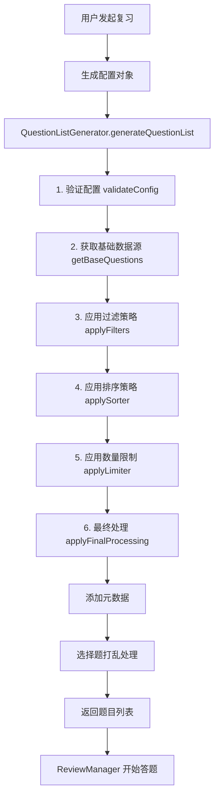

# memorin·重构计划

## 知识库模块

### 数据结构

```sql
-- 知识点
id
type
question
answer
explanation
tags
difficulty
score
options
choiceType
-- 知识区
id
name
description
-- 知识库
id
name
desctiption
icon
color
-- 知识点-知识区
id
Qid
Aid
-- 知识区-知识库
id
Aid
Bid
```

### 业务逻辑

#### 创建

- 创建知识库
- 添加知识区
- 添加知识点

#### 导入

- 导出知识库json结构
- 导入知识库json结构

#### 编辑/删除

- 编辑知识库
- 编辑知识区
- 编辑知识点
- 删除知识库
- 删除知识区
- 删除知识点

#### 复习

- 复习本知识区
- 复习本知识库
- 在知识库中创建试卷
  - 选择知识区中的知识点加入试题列表
  - 调整题目顺序功能
  - 创建试卷,保存到数据库
- 调用答题模块功能,并传递相关信息

## 答题模块

### 业务逻辑

#### 创建答题列表会话




