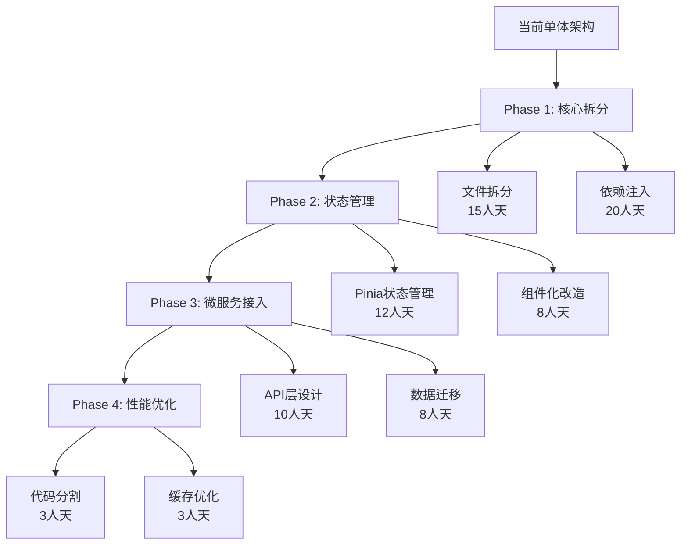

# 2-现状分析与问题识别.md

> **文档版本**: v1.0  
> **创建时间**: 2025-01-08  
> **最后更新**: 2025-01-08  
> **文档状态**: ✅ 已完成  

## 📋 文档概述

本文档基于对核心代码文件的深入分析，全面识别当前Memorin智能知识复习系统存在的技术债务、架构问题和性能瓶颈，为后续Vue重构和微服务改造提供精确的问题定位和解决方案指导。

---

## 🔍 分析方法论

### 分析范围
- **核心业务文件**: `js/app.js` (595行)、`js/review.js` (2099行)、`js/knowledge.js` (1900行)、`js/storage.js` (1272行)
- **分析维度**: 代码结构、职责分离、耦合度、可维护性、性能优化空间
- **重点关注**: 巨型文件拆分机会、全局依赖解耦、业务逻辑提取

### 分析工具
- **静态代码分析**: 文件行数统计、方法复杂度评估
- **架构模式识别**: 设计模式使用、SOLID原则遵循度
- **技术债务量化**: 重构工作量评估、风险等级划分

---

## 🚨 核心问题概览

### 问题等级分类
- 🔴 **严重问题**: 阻碍扩展性和维护性的根本性架构缺陷
- 🟡 **中等问题**: 影响开发效率和代码质量的结构性问题  
- 🟢 **轻微问题**: 可优化但不影响核心功能的改进点

### 技术债务总览
```
📊 技术债务统计
├── 巨型文件: 4个 (>500行)
├── 全局依赖: 7个主要对象
├── 混合职责: 15+个违反单一职责的类
├── DOM耦合: 200+个直接DOM操作
└── 数据一致性问题: 3个主要数据修复逻辑
```

---

## 🔴 严重架构问题

### 1. 巨型单体文件问题

#### 问题描述
```javascript
// 文件大小分布
review.js:    2099行 - 复习逻辑、SM-2算法、UI控制、事件处理
knowledge.js: 1900行 - 知识管理、表单处理、模态框、三级结构
storage.js:   1272行 - 数据CRUD、一致性检查、迁移、推断算法
app.js:        595行 - 应用控制、路由、全局事件、状态管理
```

#### 影响分析
- **维护困难**: 单个文件包含多种职责，修改风险高
- **协作障碍**: 多人开发时文件冲突概率极高
- **测试复杂**: 单元测试难以隔离，集成测试成本高
- **性能问题**: 初始加载时间长，无法按需加载

#### 重构方向
```typescript
// Vue组件化拆分建议
src/
├── components/
│   ├── Review/
│   │   ├── ReviewCard.vue        // 复习卡片组件
│   │   ├── ReviewModes.vue       // 复习模式选择
│   │   ├── ReviewProgress.vue    // 进度条组件
│   │   └── ReviewSettings.vue    // 复习配置
│   ├── Knowledge/
│   │   ├── KnowledgeBase.vue     // 知识库管理
│   │   ├── KnowledgeArea.vue     // 知识区管理
│   │   ├── KnowledgePoint.vue    // 知识点管理
│   │   └── KnowledgeForm.vue     // 知识点表单
│   └── Common/
│       ├── Modal.vue             // 通用模态框
│       ├── ProgressBar.vue       // 通用进度条
│       └── LoadingSpinner.vue    // 加载动画
├── stores/
│   ├── reviewStore.ts            // 复习状态管理
│   ├── knowledgeStore.ts         // 知识管理状态
│   └── storageStore.ts           // 数据存储状态
└── services/
    ├── reviewService.ts          // 复习服务
    ├── sm2Algorithm.ts          // SM-2算法
    ├── knowledgeService.ts      // 知识管理服务
    └── storageService.ts        // 数据存储服务
```

### 2. 全局对象耦合问题

#### 问题代码示例
```javascript
// app.js - 紧耦合的全局依赖
if (window.knowledgeManager) {
    window.knowledgeManager.loadKnowledgeBase();
}
if (window.reviewManager) {
    window.reviewManager.initReview();
}

// review.js - 直接访问其他模块
const knowledgeBase = window.storageManager.getKnowledgeBaseById(baseId);
window.app.showNotification('复习完成', 'success');

// knowledge.js - 全局状态同步
window.storageManager.setCurrentKnowledgeBase(baseId);
if (window.app && window.app.loadDashboard) {
    window.app.loadDashboard();
}
```

#### 问题分析
- **测试困难**: 无法mock依赖，单元测试几乎不可能
- **循环依赖**: 模块间相互引用，导致加载顺序敏感
- **类型安全**: 无TypeScript类型检查，运行时错误多
- **重构阻碍**: 任何模块修改都可能影响其他模块

#### Vue重构解决方案
```typescript
// 依赖注入 + Pinia状态管理
// stores/reviewStore.ts
export const useReviewStore = defineStore('review', () => {
  const knowledgeStore = useKnowledgeStore()
  const storageStore = useStorageStore()
  
  const currentReviewList = ref([])
  const currentIndex = ref(0)
  
  const startReview = async (mode: string) => {
    const knowledgeList = await knowledgeStore.getReviewList(mode)
    currentReviewList.value = knowledgeList
    currentIndex.value = 0
  }
  
  return { currentReviewList, currentIndex, startReview }
})

// components/Review/ReviewCard.vue
<script setup lang="ts">
import { useReviewStore } from '@/stores/reviewStore'
import { useNotificationStore } from '@/stores/notificationStore'

const reviewStore = useReviewStore()
const notificationStore = useNotificationStore()

const submitRating = (rating: number) => {
  reviewStore.submitRating(rating)
  notificationStore.show('评分已提交', 'success')
}
</script>
```

### 3. 职责混乱问题

#### 具体表现

**ReviewManager类职责过载**:
```javascript
class ReviewManager {
    // 🔴 业务逻辑
    calculateNextReview(easeFactor, interval, quality) { }
    updateKnowledgeReviewData(knowledgeId, rating, isCorrect) { }
    
    // 🔴 UI控制
    showReviewCard() { }
    hideAnswer() { }
    updateProgress() { }
    
    // 🔴 事件处理
    bindEvents() { }
    bindUserAnswerEvents() { }
    bindChoiceEvents() { }
    
    // 🔴 数据管理
    loadCurrentKnowledge() { }
    getReviewList(mode) { }
    loadMistakes() { }
    
    // 🔴 状态管理
    resetReviewState() { }
    getCurrentSessionInfo() { }
}
```

**KnowledgeManager类职责混合**:
```javascript
class KnowledgeManager {
    // 🔴 数据模型管理
    getKnowledgeBaseStats(knowledgeBaseId) { }
    validateKnowledgePointForm() { }
    
    // 🔴 UI渲染
    renderKnowledgeBases() { }
    renderKnowledgeAreas() { }
    showCreateKnowledgeBaseModal() { }
    
    // 🔴 表单处理
    handleSaveKnowledgePoint() { }
    collectKnowledgePointData() { }
    fillKnowledgePointForm(knowledge) { }
    
    // 🔴 业务流程
    startAreaReview(areaId) { }
    handleImport() { }
    handleExport() { }
}
```

#### Vue单一职责重构
```typescript
// 业务逻辑层 - 纯函数
// services/sm2Algorithm.ts
export class SM2Algorithm {
  static calculateNextReview(easeFactor: number, interval: number, quality: number) {
    // 纯算法逻辑，无副作用
  }
}

// services/reviewService.ts  
export class ReviewService {
  async getReviewList(mode: string): Promise<KnowledgePoint[]> {
    // 纯数据处理逻辑
  }
  
  updateReviewData(knowledgeId: string, rating: number): void {
    // 纯业务逻辑
  }
}

// 组件层 - UI逻辑
// components/Review/ReviewCard.vue
<script setup lang="ts">
interface Props {
  knowledge: KnowledgePoint
  showAnswer: boolean
}

interface Emits {
  (e: 'submit-rating', rating: number): void
  (e: 'next-question'): void
}

const props = defineProps<Props>()
const emit = defineEmits<Emits>()

// 只关注UI状态和用户交互
const isAnswerVisible = ref(false)
const userAnswer = ref('')

const toggleAnswer = () => {
  isAnswerVisible.value = !isAnswerVisible.value
}

const submitRating = (rating: number) => {
  emit('submit-rating', rating)
}
</script>

// 状态管理层 - 应用状态
// stores/reviewStore.ts
export const useReviewStore = defineStore('review', () => {
  const reviewService = new ReviewService()
  
  const currentKnowledge = ref<KnowledgePoint | null>(null)
  const reviewList = ref<KnowledgePoint[]>([])
  const currentIndex = ref(0)
  
  const submitRating = async (rating: number) => {
    if (!currentKnowledge.value) return
    
    reviewService.updateReviewData(currentKnowledge.value.id, rating)
    await nextQuestion()
  }
  
  return { currentKnowledge, reviewList, submitRating }
})
```

---

## 🟡 中等架构问题

### 1. DOM操作耦合问题

#### 问题示例
```javascript
// review.js - 大量直接DOM操作
showReviewCard() {
    const reviewCard = document.getElementById('review-card');
    const reviewModes = document.getElementById('review-modes');
    
    if (reviewCard) reviewCard.style.display = 'block';
    if (reviewModes) reviewModes.style.display = 'none';
    
    document.getElementById('user-answer-input').value = '';
    document.getElementById('review-note-input').value = '';
    // ... 更多DOM操作
}

// knowledge.js - 复杂的DOM构建
renderKnowledgeBases() {
    const container = document.getElementById('knowledge-base-grid');
    container.innerHTML = knowledgeBases.map(base => {
        return `<div class="knowledge-base-card" onclick="...">
            <div class="base-header">...</div>
            <div class="base-stats">...</div>
        </div>`;
    }).join('');
}
```

#### Vue声明式重构
```vue
<!-- components/Review/ReviewCard.vue -->
<template>
  <div v-show="visible" class="review-card">
    <div class="question-content">
      {{ currentKnowledge?.question }}
    </div>
    
    <textarea 
      v-model="userAnswer"
      placeholder="请输入你的答案..."
      @keydown.ctrl.enter="toggleAnswer"
    />
    
    <div v-show="showAnswer" class="answer-section">
      {{ currentKnowledge?.answer }}
    </div>
    
    <div class="rating-buttons">
      <button 
        v-for="rating in ratings" 
        :key="rating.value"
        @click="$emit('submit-rating', rating.value)"
        :class="['rating-btn', rating.class]"
      >
        {{ rating.label }}
      </button>
    </div>
  </div>
</template>

<script setup lang="ts">
interface Props {
  visible: boolean
  currentKnowledge: KnowledgePoint | null
  showAnswer: boolean
}

const props = defineProps<Props>()
const userAnswer = ref('')

const ratings = [
  { value: 1, label: '错误', class: 'btn-error' },
  { value: 2, label: '模糊', class: 'btn-warning' },
  { value: 3, label: '正确', class: 'btn-success' }
]
</script>
```

### 2. 数据一致性问题

#### 问题分析
```javascript
// storage.js - 运行时数据修复逻辑
getKnowledgeByBaseId(baseId) {
    // 需要运行时修复数据一致性
    data.knowledge.forEach((k, index) => {
        if (!k.knowledgeBaseId) {
            // 自动推断知识库ID
            const inferredBaseId = this.inferKnowledgeBaseId(k);
            k.knowledgeBaseId = inferredBaseId;
            wasFixed = true;
            fixedCount++;
        }
    });
    
    // 如果有数据修复，保存到存储
    if (fixedCount > 0) {
        this.setData(data);
    }
}

// 复杂的推断算法
inferKnowledgeBaseId(knowledge) {
    // 策略1: 基于ID前缀匹配
    if (knowledge.id.startsWith('mil_')) return 'military_theory_base';
    if (knowledge.id.startsWith('se_')) return 'software_engineering_base';
    
    // 策略2: 基于分类模糊匹配
    // 策略3: 基于标签匹配
    // ... 更多复杂逻辑
}
```

#### 微服务数据一致性解决方案
```typescript
// 后端数据模型 - 强类型约束
// models/KnowledgePoint.ts
export interface KnowledgePoint {
  id: string                    // 必填，UUID
  knowledgeBaseId: string      // 必填，外键约束
  areaId: string               // 必填，外键约束
  question: string             // 必填
  answer: string               // 必填
  createdAt: Date             // 自动生成
  updatedAt: Date             // 自动更新
}

// 数据库约束
CREATE TABLE knowledge_points (
  id VARCHAR(36) PRIMARY KEY,
  knowledge_base_id VARCHAR(36) NOT NULL,
  area_id VARCHAR(36) NOT NULL,
  question TEXT NOT NULL,
  answer TEXT NOT NULL,
  created_at TIMESTAMP DEFAULT CURRENT_TIMESTAMP,
  updated_at TIMESTAMP DEFAULT CURRENT_TIMESTAMP ON UPDATE CURRENT_TIMESTAMP,
  
  FOREIGN KEY (knowledge_base_id) REFERENCES knowledge_bases(id) ON DELETE CASCADE,
  FOREIGN KEY (area_id) REFERENCES knowledge_areas(id) ON DELETE CASCADE,
  
  INDEX idx_knowledge_base (knowledge_base_id),
  INDEX idx_area (area_id)
);

// 服务层数据验证
// services/KnowledgeService.ts
export class KnowledgeService {
  async createKnowledgePoint(data: CreateKnowledgePointDto): Promise<KnowledgePoint> {
    // 验证知识库存在
    const knowledgeBase = await this.knowledgeBaseService.findById(data.knowledgeBaseId)
    if (!knowledgeBase) {
      throw new NotFoundException('知识库不存在')
    }
    
    // 验证知识区存在且属于该知识库
    const area = await this.knowledgeAreaService.findById(data.areaId)
    if (!area || area.knowledgeBaseId !== data.knowledgeBaseId) {
      throw new BadRequestException('知识区不属于指定知识库')
    }
    
    return await this.repository.create(data)
  }
}
```

### 3. 事件处理复杂性

#### 问题表现
```javascript
// review.js - 复杂的事件绑定逻辑
bindUserAnswerEvents() {
    const userAnswerInput = document.getElementById('user-answer-input');
    
    // 创建事件处理函数（保存引用以便移除）
    if (!this.userAnswerKeydownHandler) {
        this.userAnswerKeydownHandler = (e) => {
            if (e.ctrlKey && e.key === 'Enter') {
                e.preventDefault();
                this.toggleAnswer();
            }
            
            if (e.key === 'ArrowLeft' || e.key === 'ArrowRight') {
                e.stopPropagation();
            }
        };
    }
    
    // 移除旧的事件监听器（如果存在）
    userAnswerInput.removeEventListener('keydown', this.userAnswerKeydownHandler);
    
    // 添加新的事件监听器
    userAnswerInput.addEventListener('keydown', this.userAnswerKeydownHandler);
}
```

#### Vue事件处理重构
```vue
<!-- components/Review/AnswerInput.vue -->
<template>
  <div class="answer-input-container">
    <textarea
      v-model="userAnswer"
      @keydown.ctrl.enter.prevent="$emit('toggle-answer')"
      @keydown.left.stop
      @keydown.right.stop
      @focus="$emit('focus')"
      @blur="$emit('blur')"
      @input="autoResize"
      ref="textareaRef"
      placeholder="请输入你的答案..."
      class="user-answer-input"
    />
  </div>
</template>

<script setup lang="ts">
interface Emits {
  (e: 'toggle-answer'): void
  (e: 'focus'): void
  (e: 'blur'): void
  (e: 'update:modelValue', value: string): void
}

const emit = defineEmits<Emits>()
const userAnswer = defineModel<string>({ required: true })
const textareaRef = ref<HTMLTextAreaElement>()

const autoResize = () => {
  if (textareaRef.value) {
    textareaRef.value.style.height = 'auto'
    textareaRef.value.style.height = Math.max(120, textareaRef.value.scrollHeight) + 'px'
  }
}

// 使用Composition API的生命周期
onMounted(() => {
  autoResize()
})
</script>
```

---

## 🟢 性能优化机会

### 1. 初始加载优化

#### 当前问题
```javascript
// 所有JS文件同步加载
<script src="js/app.js"></script>
<script src="js/storage.js"></script>
<script src="js/knowledge.js"></script>  // 1900行
<script src="js/review.js"></script>     // 2099行
<script src="js/statistics.js"></script>
```

#### Vite + Vue优化方案
```typescript
// vite.config.ts - 代码分割配置
export default defineConfig({
  build: {
    rollupOptions: {
      output: {
        manualChunks: {
          'vendor': ['vue', 'pinia'],
          'review': ['./src/components/Review/index.ts'],
          'knowledge': ['./src/components/Knowledge/index.ts'],
          'statistics': ['./src/components/Statistics/index.ts']
        }
      }
    }
  }
})

// router/index.ts - 路由懒加载
const routes = [
  {
    path: '/review',
    component: () => import('@/views/ReviewView.vue')  // 懒加载
  },
  {
    path: '/knowledge', 
    component: () => import('@/views/KnowledgeView.vue')
  }
]
```

### 2. 数据处理优化

#### 当前性能问题
```javascript
// 每次都重新计算所有数据
renderKnowledgePoints() {
    const allKnowledge = window.storageManager.getKnowledgeByAreaId(this.currentArea.id);
    
    // 每次渲染都重新过滤和排序
    this.filteredPoints = allKnowledge.filter(point => {
        // 复杂的过滤逻辑
    }).sort((a, b) => {
        // 复杂的排序逻辑  
    });
}
```

#### Vue响应式优化
```typescript
// composables/useKnowledgeFilter.ts
export function useKnowledgeFilter(knowledgeList: Ref<KnowledgePoint[]>) {
  const searchQuery = ref('')
  const selectedTags = ref<string[]>([])
  const sortBy = ref<'createdAt' | 'updatedAt' | 'difficulty'>('createdAt')
  
  // 使用computed缓存计算结果
  const filteredKnowledge = computed(() => {
    let result = knowledgeList.value
    
    // 搜索过滤
    if (searchQuery.value) {
      result = result.filter(item => 
        item.question.toLowerCase().includes(searchQuery.value.toLowerCase())
      )
    }
    
    // 标签过滤
    if (selectedTags.value.length > 0) {
      result = result.filter(item =>
        selectedTags.value.some(tag => item.tags.includes(tag))
      )
    }
    
    // 排序
    result = result.sort((a, b) => {
      return new Date(b[sortBy.value]).getTime() - new Date(a[sortBy.value]).getTime()
    })
    
    return result
  })
  
  return {
    searchQuery,
    selectedTags, 
    sortBy,
    filteredKnowledge
  }
}
```

---

## 📊 重构工作量评估

### 优先级矩阵

| 问题类别 | 影响程度 | 修复难度 | 优先级 | 预估工作量 |
|---------|---------|---------|--------|-----------|
| 巨型文件拆分 | 🔴 极高 | 🟡 中等 | **P0** | 15人天 |
| 全局依赖解耦 | 🔴 极高 | 🔴 困难 | **P0** | 20人天 |
| 职责分离重构 | 🟡 高 | 🟡 中等 | **P1** | 12人天 |
| DOM操作重构 | 🟡 高 | 🟢 简单 | **P1** | 8人天 |
| 数据一致性修复 | 🔴 极高 | 🔴 困难 | **P0** | 10人天 |
| 事件处理优化 | 🟢 中等 | 🟢 简单 | **P2** | 5人天 |
| 性能优化 | 🟡 高 | 🟢 简单 | **P1** | 6人天 |

### 重构路径规划



---

## 🎯 重构成功标准

### 代码质量指标
- **文件大小**: 单个文件不超过500行
- **方法复杂度**: 单个方法不超过50行
- **耦合度**: 模块间依赖关系清晰，无循环依赖
- **测试覆盖率**: 核心业务逻辑达到90%以上
- **UI组件一致性**: 70%自定义组件保持毛玻璃主题，30%组件库完美融合

### 性能提升目标
- **初始加载时间**: 减少60%（从3s到1.2s）
- **路由切换**: 减少80%（从500ms到100ms）
- **数据处理**: 减少70%（大列表渲染优化）
- **内存使用**: 减少40%（组件按需加载）

### 开发体验改善
- **热重载**: 支持组件级热更新
- **类型安全**: 100% TypeScript覆盖
- **开发调试**: Vue DevTools完整支持
- **构建速度**: Vite极速构建（<5s）
- **组件复用**: 自定义组件库复用率达到80%以上

---

## 📋 下一步行动计划

### 立即行动项（P0）
1. **创建Vue项目架构** - 搭建Vite + Vue3 + TypeScript基础框架
2. **设计状态管理** - 定义Pinia store结构和数据流
3. **制定拆分策略** - 确定巨型文件的具体拆分方案

### 短期规划（1-2周）
1. **核心组件重构** - 优先重构ReviewCard和KnowledgeForm组件
2. **API接口设计** - 定义前后端数据交互契约
3. **数据迁移方案** - 制定LocalStorage到数据库的迁移策略

### 中期目标（3-4周）
1. **微服务集成** - 完成核心服务的前端接入
2. **性能优化** - 实施代码分割和懒加载
3. **测试完善** - 建立自动化测试体系

---

**文档状态**: ✅ **已完成**  
**下一步**: [Task-3: 技术栈选型与架构设计](./3-技术栈选型与架构设计.md) 