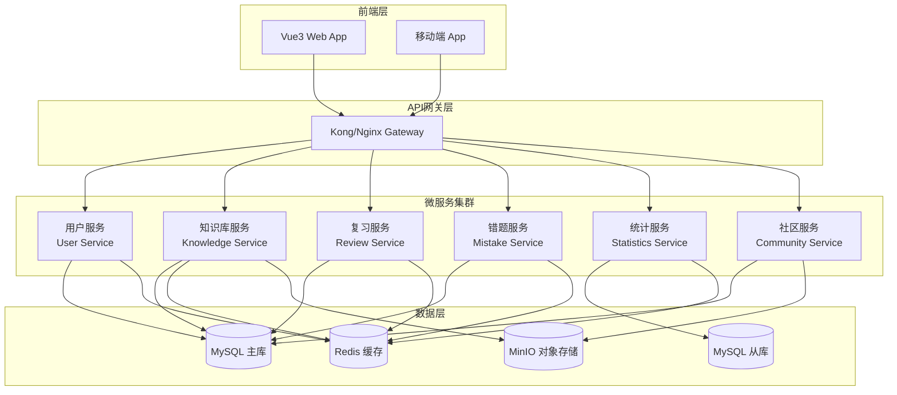
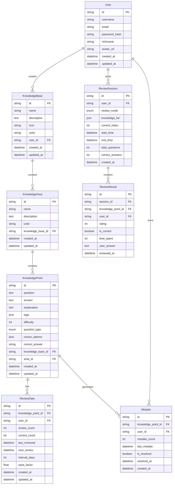
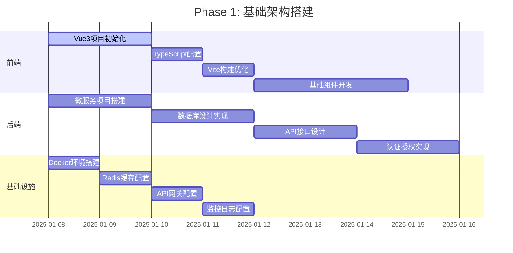
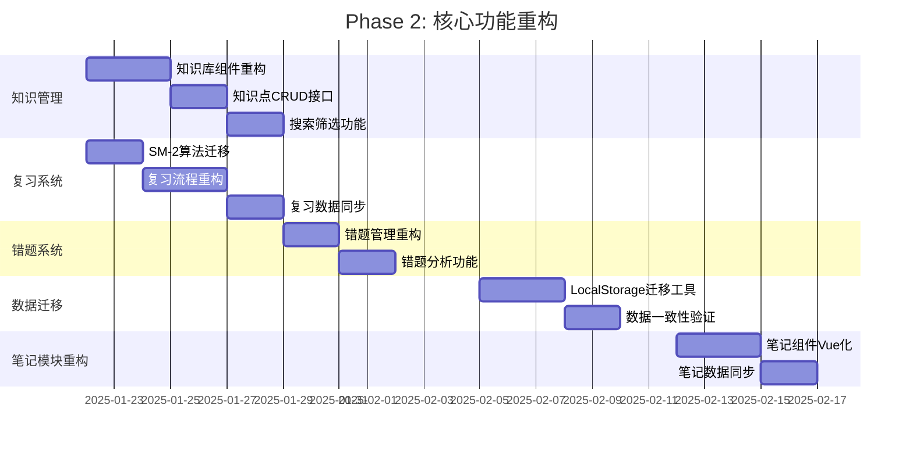
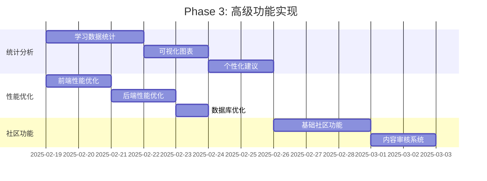
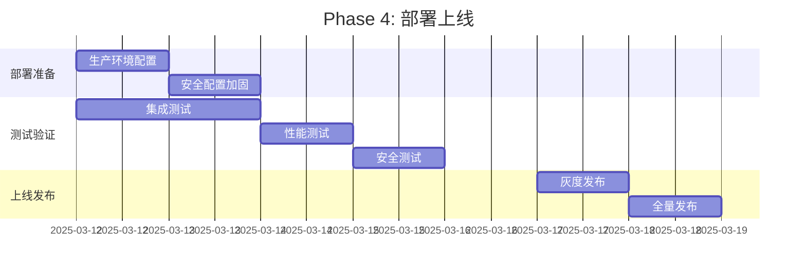

# 3-技术栈选型与架构设计.md

> **文档版本**: v1.0  
> **创建时间**: 2025-01-08  
> **最后更新**: 2025-01-08  
> **文档状态**: 🔄 进行中  

## 📋 文档概述

本文档基于Task-1的重构目标和Task-2的问题分析，确定Memorin智能知识复习系统重构的具体技术栈选择，设计完整的Vue3+微服务架构方案，并制定详细的技术实施路径。

---

## 🛠️ 前端技术栈选型

### 核心技术栈对比

| 技术领域 | 候选方案 | 推荐选择 | 选择理由 |
|---------|---------|---------|---------|
| **框架** | Vue3 vs React vs Angular | **Vue3** | 学习曲线平缓，生态成熟，组合式API适合重构 |
| **构建工具** | Vite vs Webpack vs Parcel | **Vite** | 极速热重载，ES模块原生支持，Vue官方推荐 |
| **语言** | TypeScript vs JavaScript | **TypeScript** | 类型安全，重构保障，IDE支持强 |
| **状态管理** | Pinia vs Vuex vs Zustand | **Pinia** | Vue3官方推荐，组合式API风格一致 |
| **路由** | Vue Router vs Reach Router | **Vue Router 4** | Vue生态标准，支持组合式API |
| **UI策略** | 纯自定义 vs 纯组件库 vs 混合策略 | **混合策略** | 核心视觉自定义 + 功能性组件库 |
| **测试** | Vitest vs Jest | **Vitest** | Vite原生集成，配置简单，性能优秀 |

### UI组件策略详细规划

#### 1. 组件分类策略

```typescript
// 组件使用策略分类
const componentStrategy = {
  // 🎨 自定义组件 - 核心视觉组件 (70%)
  custom: [
    'GlassCard',        // 毛玻璃卡片（核心主题组件）
    'GlassButton',      // 毛玻璃按钮
    'GlassModal',       // 毛玻璃模态框
    'GlassInput',       // 毛玻璃输入框
    'ReviewCard',       // 复习卡片（业务核心）
    'KnowledgeTree',    // 知识树（业务特色）
    'StatCard',         // 统计卡片（仪表盘核心）
    'GradientHeader',   // 渐变头部
    'MistakeCard',      // 错题卡片
    'ProgressBar',      // 自定义进度条
    'NotificationToast' // 通知组件
  ],
  
  // 📚 组件库 - 功能性组件 (25%) 
  library: [
    'ElTable',          // 数据表格（可完全重新设计样式）
    'ElDatePicker',     // 日期选择器（弹窗类，可独立设计）
    'ElPagination',     // 分页器（功能性，易于定制）
    'ElForm',           // 表单验证（逻辑性，样式可覆盖）
    'ElSelect',         // 下拉选择器
    'ElSwitch',         // 开关组件
    'ElSlider',         // 滑块组件
  ],
  
  // 🔧 工具类组件 - 无样式影响 (5%)
  utility: [
    'ElLoading',        // 加载指令
    'ElMessage',        // 消息提示（可完全自定义样式）
    'ElMessageBox',     // 确认对话框（可完全重新设计）
    'ElTooltip',        // 工具提示
    'ElPopover',        // 弹出框
  ]
}
```

#### 2. 样式保持策略

```scss
// styles/theme-override.scss
// Element Plus组件毛玻璃主题改造

// 表格组件毛玻璃化
.glass-table {
  .el-table {
    background: rgba(255, 255, 255, 0.7);
    backdrop-filter: blur(20px);
    border-radius: 15px;
    border: 1px solid rgba(102, 126, 234, 0.1);
    
    .el-table__header {
      background: linear-gradient(135deg, 
        rgba(102, 126, 234, 0.05) 0%, 
        rgba(118, 75, 162, 0.05) 100%);
    }
    
    .el-table__row:hover {
      background: rgba(102, 126, 234, 0.05);
    }
  }
}

// 日期选择器毛玻璃化
.glass-date-picker {
  .el-input__inner {
    background: rgba(255, 255, 255, 0.8);
    backdrop-filter: blur(10px);
    border: 2px solid rgba(102, 126, 234, 0.2);
    border-radius: 12px;
  }
}

// 分页器毛玻璃化
.glass-pagination {
  .el-pagination {
    .el-pager li {
      background: rgba(255, 255, 255, 0.7);
      backdrop-filter: blur(10px);
      border-radius: 8px;
      border: 1px solid rgba(102, 126, 234, 0.1);
    }
    
    .el-pager li.active {
      background: linear-gradient(135deg, #667eea 0%, #764ba2 100%);
      color: white;
    }
  }
}
```

#### 3. 实施优先级规划

```typescript
// 组件实施阶段规划
const implementationPhases = {
  // Phase 1: 核心自定义组件（必须优先）
  phase1: {
    priority: 'P0',
    duration: '2周',
    components: [
      'GlassCard',      // 最核心的视觉组件
      'GlassButton',    // 基础交互组件
      'GlassModal',     // 重要弹窗组件
      'GlassInput',     // 基础表单组件
    ],
    reason: '这些组件是毛玻璃主题的核心，必须自定义保证视觉一致性'
  },
  
  // Phase 2: 业务组件迁移（重要）
  phase2: {
    priority: 'P1', 
    duration: '3周',
    components: [
      'ReviewCard',     // 复习卡片
      'KnowledgeCard',  // 知识点卡片
      'StatCard',       // 统计卡片
      'MistakeCard',    // 错题卡片
      'GradientHeader', // 渐变头部
    ],
    reason: '业务特色组件，体现产品独特性和用户体验'
  },
  
  // Phase 3: 组件库集成（优化）
  phase3: {
    priority: 'P2',
    duration: '1周', 
    components: [
      'ElTable + 毛玻璃样式覆盖',
      'ElDatePicker + 毛玻璃样式覆盖',
      'ElPagination + 毛玻璃样式覆盖',
      'ElForm + 验证逻辑集成',
    ],
    reason: '提升开发效率，降低维护成本，不影响核心主题'
  }
}
```

#### 4. 组件设计规范

```vue
<!-- 自定义组件设计模板 -->
<!-- components/Glass/GlassCard.vue -->
<template>
  <div 
    :class="['glass-card', `glass-${variant}`, { 'glass-hover': hover }]"
    :style="cardStyles"
  >
    <!-- 保持原有HTML结构 -->
    <div class="glass-card-before" v-if="showBorder"></div>
    <div class="glass-card-content">
      <slot />
    </div>
  </div>
</template>

<script setup lang="ts">
interface Props {
  variant?: 'default' | 'modal' | 'knowledge' | 'mistake' | 'review'
  blur?: number           // 可定制模糊程度
  opacity?: number        // 可定制透明度
  hover?: boolean         // 是否支持hover效果
  showBorder?: boolean    // 是否显示边框效果
}

const props = withDefaults(defineProps<Props>(), {
  variant: 'default',
  blur: 20,
  opacity: 0.7,
  hover: true,
  showBorder: true
})

// 基于CSS变量的样式定制
const cardStyles = computed(() => ({
  '--glass-blur': `${props.blur}px`,
  '--glass-opacity': props.opacity,
}))
</script>

<style scoped>
/* 完全复用原有的.knowledge-card等样式类 */
.glass-card {
  background: rgba(255, 255, 255, var(--glass-opacity));
  backdrop-filter: blur(var(--glass-blur));
  -webkit-backdrop-filter: blur(var(--glass-blur));
  border: 1px solid rgba(102, 126, 234, 0.1);
  border-radius: 15px;
  box-shadow: 0 4px 20px rgba(102, 126, 234, 0.08);
  padding: 1.5rem;
  transition: all 0.4s ease;
  position: relative;
  overflow: hidden;
}

/* 根据variant应用不同的主题色 */
.glass-knowledge { border-left: 4px solid #667eea; }
.glass-mistake { border-left: 4px solid #e74c3c; }
.glass-review { border-left: 4px solid #2ecc71; }

/* 继承原有的精美hover效果 */
.glass-hover:hover {
  transform: translateY(-2px);
  box-shadow: 0 8px 30px rgba(102, 126, 234, 0.15);
}
</style>
```

### 前端架构设计

```typescript
// 项目结构设计
src/
├── assets/                 // 静态资源
│   ├── icons/             // 图标文件
│   ├── images/            // 图片资源
│   └── styles/            // 全局样式
│       ├── base.css       // 基础样式
│       ├── components.css // 组件样式（保留原有）
│       └── responsive.css // 响应式样式
├── components/            // 通用组件
│   ├── Common/           // 基础组件
│   │   ├── AppModal.vue  // 通用模态框
│   │   ├── AppButton.vue // 通用按钮
│   │   └── AppLoading.vue// 加载组件
│   ├── Layout/           // 布局组件
│   │   ├── AppHeader.vue // 头部导航
│   │   ├── AppSidebar.vue// 侧边栏
│   │   └── AppMain.vue   // 主内容区
│   └── Business/         // 业务组件
│       ├── ReviewCard.vue     // 复习卡片
│       ├── KnowledgeTree.vue  // 知识树
│       └── StatisticsChart.vue// 统计图表
├── views/                // 页面组件
│   ├── Dashboard/        // 仪表盘
│   ├── Knowledge/        // 知识管理
│   ├── Review/           // 复习模块
│   ├── Mistakes/         // 错题本
│   ├── Notes/            // 笔记编辑器
│   └── Statistics/       // 统计分析
├── stores/               // 状态管理
│   ├── auth.ts          // 用户认证状态
│   ├── knowledge.ts     // 知识管理状态
│   ├── review.ts        // 复习状态
│   ├── notes.ts         // 笔记编辑状态
│   └── statistics.ts    // 统计状态
├── services/            // 服务层
│   ├── api/            // API接口
│   │   ├── auth.ts     // 认证接口
│   │   ├── knowledge.ts// 知识库接口
│   │   ├── review.ts   // 复习接口
│   │   └── notes.ts    // 笔记编辑接口
│   ├── algorithms/     // 算法服务
│   │   ├── sm2.ts      // SM-2算法
│   │   └── statistics.ts// 统计算法
│   └── utils/          // 工具函数
│       ├── storage.ts  // 存储工具
│       ├── validation.ts// 验证工具
│       └── format.ts   // 格式化工具
├── composables/        // 组合式函数
│   ├── useAuth.ts      // 认证逻辑
│   ├── useReview.ts    // 复习逻辑
│   ├── useKnowledge.ts // 知识管理逻辑
│   └── useNotes.ts     // 笔记编辑逻辑
├── types/              // TypeScript类型定义
│   ├── api.ts          // API接口类型
│   ├── knowledge.ts    // 知识模型类型
│   ├── review.ts       // 复习模型类型
│   └── notes.ts        // 笔记模型类型
└── router/             // 路由配置
    └── index.ts        // 路由定义
```

### 技术选型详细说明

#### 1. Vue3 + Composition API
```typescript
// 组合式API重构示例 - 复习逻辑
// composables/useReview.ts
export function useReview() {
  const reviewStore = useReviewStore()
  const { currentKnowledge, reviewList, currentIndex } = storeToRefs(reviewStore)
  
  const progress = computed(() => {
    if (reviewList.value.length === 0) return 0
    return Math.round((currentIndex.value / reviewList.value.length) * 100)
  })
  
  const submitRating = async (rating: number) => {
    await reviewStore.submitRating(rating)
    if (currentIndex.value < reviewList.value.length - 1) {
      await nextQuestion()
    } else {
      await completeReview()
    }
  }
  
  const nextQuestion = async () => {
    await reviewStore.nextQuestion()
  }
  
  const completeReview = async () => {
    await reviewStore.completeReview()
    router.push('/dashboard')
  }
  
  return {
    currentKnowledge: readonly(currentKnowledge),
    progress: readonly(progress),
    submitRating,
    nextQuestion,
    completeReview
  }
}
```

#### 2. Pinia状态管理
```typescript
// stores/review.ts
export const useReviewStore = defineStore('review', () => {
  // 状态
  const currentReviewList = ref<KnowledgePoint[]>([])
  const currentIndex = ref(0)
  const reviewMode = ref<ReviewMode | null>(null)
  const startTime = ref<Date | null>(null)
  
  // 计算属性
  const currentKnowledge = computed(() => {
    return currentReviewList.value[currentIndex.value] || null
  })
  
  const isLastQuestion = computed(() => {
    return currentIndex.value >= currentReviewList.value.length - 1
  })
  
  // 操作
  const startReview = async (mode: ReviewMode) => {
    const knowledgeService = useKnowledgeService()
    reviewMode.value = mode
    currentReviewList.value = await knowledgeService.getReviewList(mode)
    currentIndex.value = 0
    startTime.value = new Date()
  }
  
  const submitRating = async (rating: number) => {
    if (!currentKnowledge.value) return
    
    const reviewService = useReviewService()
    await reviewService.updateReviewData(
      currentKnowledge.value.id, 
      rating,
      Date.now() - (startTime.value?.getTime() || 0)
    )
  }
  
  const nextQuestion = async () => {
    if (!isLastQuestion.value) {
      currentIndex.value++
      startTime.value = new Date()
    }
  }
  
  return {
    // 状态
    currentReviewList: readonly(currentReviewList),
    currentIndex: readonly(currentIndex),
    reviewMode: readonly(reviewMode),
    
    // 计算属性
    currentKnowledge,
    isLastQuestion,
    
    // 操作
    startReview,
    submitRating,
    nextQuestion
  }
})
```

#### 3. TypeScript类型系统
```typescript
// types/knowledge.ts
export interface KnowledgeBase {
  id: string
  name: string
  description: string
  icon: string
  color: string
  createdAt: string
  updatedAt: string
  areas: KnowledgeArea[]
}

export interface KnowledgeArea {
  id: string
  name: string
  description: string
  color: string
  knowledgeBaseId: string
  knowledgePoints: KnowledgePoint[]
}

export interface KnowledgePoint {
  id: string
  question: string
  answer: string
  explanation?: string
  tags: string[]
  difficulty: 1 | 2 | 3 | 4 | 5
  questionType: 'fill' | 'choice'
  choiceOptions?: ChoiceOption[]
  correctAnswer?: string
  knowledgeBaseId: string
  areaId: string
  reviewData: ReviewData
  createdAt: string
  updatedAt: string
}

export interface ReviewData {
  reviewCount: number
  correctCount: number
  lastReviewed: string | null
  nextReview: string
  interval: number
  easeFactor: number
}

export interface ChoiceOption {
  key: string
  text: string
}

// types/review.ts
export type ReviewMode = 
  | 'smart'           // 智能复习
  | 'all'             // 全部复习
  | 'mistakes'        // 错题复习
  | 'weakness'        // 薄弱环节
  | 'knowledge-base'  // 按知识库
  | 'knowledge-area'  // 按知识区

export interface ReviewSession {
  id: string
  mode: ReviewMode
  knowledgeList: KnowledgePoint[]
  currentIndex: number
  startTime: string
  endTime?: string
  totalQuestions: number
  correctAnswers: number
}

export interface ReviewResult {
  knowledgeId: string
  rating: 1 | 2 | 3
  isCorrect: boolean
  timeSpent: number
  userAnswer?: string
  reviewedAt: string
}
```

---

## 📝 笔记模块架构设计

### 现有笔记模块分析

根据《笔记模块开发总结.md》，当前系统已经实现了一个完整的笔记编辑模块，具有以下特点：

- **文件结构**: `notes.html` (主页面) + `js/notes-manager.js` (1200+行核心逻辑)
- **功能完整**: 可视化编辑、三级架构支持、多格式导入导出
- **UI一致性**: 延续毛玻璃主题，与主系统保持视觉一致
- **数据兼容**: 100%兼容主系统数据结构

### 笔记模块Vue化重构方案

#### 1. 组件化拆分策略

```typescript
// Notes模块组件树设计
src/views/Notes/
├── NotesEditor.vue           // 主编辑器页面
├── components/
│   ├── NotesTree.vue         // 左侧树状结构
│   ├── NotesEditForm.vue     // 右侧编辑表单
│   ├── KnowledgeBaseForm.vue // 知识库编辑表单
│   ├── KnowledgeAreaForm.vue // 知识区编辑表单
│   ├── KnowledgePointForm.vue// 知识点编辑表单
│   ├── NotesToolbar.vue      // 顶部工具栏
│   ├── ImportExportModal.vue // 导入导出模态框
│   └── FormatSelector.vue    // 格式选择器
└── composables/
    ├── useNotesTree.ts       // 树状结构逻辑
    ├── useNotesEdit.ts       // 编辑逻辑
    ├── useNotesImport.ts     // 导入逻辑
    └── useNotesExport.ts     // 导出逻辑
```

#### 2. 状态管理设计

```typescript
// stores/notes.ts
export const useNotesStore = defineStore('notes', () => {
  // 状态
  const notesData = ref<NotesData>({
    knowledgeBases: []
  })
  
  const selectedItem = ref<{
    type: 'base' | 'area' | 'point' | null,
    id: string | null,
    data: any
  }>({
    type: null,
    id: null,
    data: null
  })
  
  const editMode = ref<'create' | 'edit' | 'view'>('view')
  
  // 计算属性
  const currentEditForm = computed(() => {
    switch (selectedItem.value.type) {
      case 'base': return 'KnowledgeBaseForm'
      case 'area': return 'KnowledgeAreaForm'
      case 'point': return 'KnowledgePointForm'
      default: return null
    }
  })
  
  // 操作方法
  const selectItem = (type: string, id: string, data: any) => {
    selectedItem.value = { type, id, data }
    editMode.value = 'view'
  }
  
  const startEdit = () => {
    editMode.value = 'edit'
  }
  
  const saveChanges = async (formData: any) => {
    // 保存逻辑
    await updateNotesData(formData)
    editMode.value = 'view'
  }
  
  const exportNotes = async (format: 'json' | 'markdown') => {
    // 导出逻辑
    const exporter = format === 'json' ? exportAsJSON : exportAsMarkdown
    return await exporter(notesData.value)
  }
  
  const importNotes = async (file: File, format: 'json' | 'markdown') => {
    // 导入逻辑
    const importer = format === 'json' ? importFromJSON : importFromMarkdown
    const newData = await importer(file)
    await mergeNotesData(newData)
  }
  
  const syncToMainSystem = async () => {
    // 同步到主系统
    const knowledgeStore = useKnowledgeStore()
    await knowledgeStore.importFromNotes(notesData.value)
  }
  
  return {
    // 状态
    notesData: readonly(notesData),
    selectedItem: readonly(selectedItem),
    editMode: readonly(editMode),
    
    // 计算属性
    currentEditForm,
    
    // 操作
    selectItem,
    startEdit,
    saveChanges,
    exportNotes,
    importNotes,
    syncToMainSystem
  }
})
```

#### 3. 数据格式统一

```typescript
// types/notes.ts
export interface NotesData {
  knowledgeBases: NotesKnowledgeBase[]
  metadata?: {
    version: string
    createdAt: string
    lastModified: string
  }
}

export interface NotesKnowledgeBase {
  id: string
  name: string
  description: string
  icon: string
  color: string
  areas: NotesKnowledgeArea[]
  createdAt: string
  updatedAt: string
}

export interface NotesKnowledgeArea {
  id: string
  name: string
  description: string
  color: string
  knowledgePoints: NotesKnowledgePoint[]
  createdAt: string
  updatedAt: string
}

export interface NotesKnowledgePoint {
  id: string
  type: 'fill' | 'choice'
  question: string
  answer: string
  explanation: string
  tags: string[]
  difficulty: number
  
  // 选择题特有字段
  choiceType?: 'single' | 'multiple'
  options?: NotesChoiceOption[]
  correctAnswer?: string
  
  // 元数据
  createdAt: string
  updatedAt: string
}

export interface NotesChoiceOption {
  key: string
  text: string
  isCorrect?: boolean
}
```

#### 4. 导入导出服务

```typescript
// services/notes.ts
export class NotesService {
  
  // JSON格式导入导出
  async exportAsJSON(notesData: NotesData): Promise<string> {
    const exportData = {
      ...notesData,
      metadata: {
        version: '1.0',
        createdAt: new Date().toISOString(),
        lastModified: new Date().toISOString(),
        exportedBy: 'Memorin Notes Editor'
      }
    }
    return JSON.stringify(exportData, null, 2)
  }
  
  async importFromJSON(jsonString: string): Promise<NotesData> {
    const data = JSON.parse(jsonString)
    return this.validateAndNormalizeData(data)
  }
  
  // Markdown格式导入导出
  async exportAsMarkdown(notesData: NotesData): Promise<string> {
    let markdown = '# Memorin Knowledge Base Export\n\n'
    
    for (const base of notesData.knowledgeBases) {
      markdown += `## ${base.name}\n\n`
      markdown += `${base.description}\n\n`
      
      for (const area of base.areas) {
        markdown += `### ${area.name}\n\n`
        markdown += `${area.description}\n\n`
        
        for (const point of area.knowledgePoints) {
          markdown += `#### ${point.question}\n\n`
          markdown += `**答案**: ${point.answer}\n\n`
          if (point.explanation) {
            markdown += `**解释**: ${point.explanation}\n\n`
          }
          if (point.tags.length > 0) {
            markdown += `**标签**: ${point.tags.join(', ')}\n\n`
          }
          markdown += `**难度**: ${point.difficulty}/5\n\n`
          markdown += '---\n\n'
        }
      }
    }
    
    return markdown
  }
  
  async importFromMarkdown(markdownContent: string): Promise<NotesData> {
    // Markdown解析逻辑
    return this.parseMarkdownToNotesData(markdownContent)
  }
  
  // 数据验证和格式化
  private validateAndNormalizeData(data: any): NotesData {
    // 数据验证和格式化逻辑
    return {
      knowledgeBases: data.knowledgeBases || [],
      metadata: data.metadata || {
        version: '1.0',
        createdAt: new Date().toISOString(),
        lastModified: new Date().toISOString()
      }
    }
  }
  
  // 与主系统数据格式转换
  async convertToMainSystemFormat(notesData: NotesData): Promise<KnowledgeBase[]> {
    return notesData.knowledgeBases.map(base => ({
      id: base.id,
      name: base.name,
      description: base.description,
      icon: base.icon,
      color: base.color,
      areas: base.areas.map(area => ({
        id: area.id,
        name: area.name,
        description: area.description,
        color: area.color,
        knowledgePoints: area.knowledgePoints.map(point => ({
          id: point.id,
          type: point.type,
          question: point.question,
          answer: point.answer,
          explanation: point.explanation,
          tags: point.tags,
          difficulty: point.difficulty,
          // 选择题字段
          ...(point.type === 'choice' && {
            choiceType: point.choiceType,
            options: point.options?.map(opt => ({
              key: opt.key,
              text: opt.text
            })) || [],
            correctAnswer: point.correctAnswer
          }),
          // 复习数据初始化
          reviewData: {
            easeFactor: 2.5,
            interval: 1,
            repetitions: 0,
            nextReviewDate: new Date().toISOString(),
            lastReviewDate: null,
            totalReviews: 0,
            correctCount: 0,
            averageResponseTime: 0
          }
        }))
      }))
    }))
  }
}
```

#### 5. 组件实现示例

```vue
<!-- views/Notes/NotesEditor.vue -->
<template>
  <div class="notes-editor">
    <div class="notes-header">
      <h1>📝 Memorin 笔记编辑器</h1>
      <NotesToolbar 
        @import="handleImport"
        @export="handleExport"
        @save="handleSave"
        @sync="handleSync"
        @back="handleBack"
      />
    </div>
    
    <div class="notes-content">
      <div class="notes-tree-panel">
        <NotesTree
          :notes-data="notesData"
          :selected-item="selectedItem"
          @select="handleSelect"
          @create="handleCreate"
          @delete="handleDelete"
        />
      </div>
      
      <div class="notes-edit-panel">
        <component 
          :is="currentEditForm"
          v-if="currentEditForm"
          :data="selectedItem.data"
          :mode="editMode"
          @save="handleSaveForm"
          @cancel="handleCancel"
        />
        <div v-else class="empty-state">
          <p>请选择左侧项目进行编辑</p>
        </div>
      </div>
    </div>
    
    <ImportExportModal
      v-model:visible="showImportExport"
      :mode="importExportMode"
      @import="handleImportFile"
      @export="handleExportFile"
    />
  </div>
</template>

<script setup lang="ts">
import { computed, ref } from 'vue'
import { useNotesStore } from '@/stores/notes'
import { useRouter } from 'vue-router'
import NotesToolbar from './components/NotesToolbar.vue'
import NotesTree from './components/NotesTree.vue'
import KnowledgeBaseForm from './components/KnowledgeBaseForm.vue'
import KnowledgeAreaForm from './components/KnowledgeAreaForm.vue'
import KnowledgePointForm from './components/KnowledgePointForm.vue'
import ImportExportModal from './components/ImportExportModal.vue'

const notesStore = useNotesStore()
const router = useRouter()

// 状态
const showImportExport = ref(false)
const importExportMode = ref<'import' | 'export'>('import')

// 计算属性
const notesData = computed(() => notesStore.notesData)
const selectedItem = computed(() => notesStore.selectedItem)
const editMode = computed(() => notesStore.editMode)
const currentEditForm = computed(() => notesStore.currentEditForm)

// 事件处理
const handleSelect = (type: string, id: string, data: any) => {
  notesStore.selectItem(type, id, data)
}

const handleCreate = (type: string, parentId?: string) => {
  notesStore.createItem(type, parentId)
}

const handleDelete = (type: string, id: string) => {
  notesStore.deleteItem(type, id)
}

const handleSaveForm = (formData: any) => {
  notesStore.saveChanges(formData)
}

const handleCancel = () => {
  notesStore.cancelEdit()
}

const handleImport = () => {
  importExportMode.value = 'import'
  showImportExport.value = true
}

const handleExport = () => {
  importExportMode.value = 'export'
  showImportExport.value = true
}

const handleSave = async () => {
  await notesStore.saveToStorage()
  // 显示成功提示
}

const handleSync = async () => {
  await notesStore.syncToMainSystem()
  // 显示成功提示
}

const handleBack = () => {
  router.push('/dashboard')
}

const handleImportFile = async (file: File, format: string) => {
  await notesStore.importNotes(file, format)
  showImportExport.value = false
}

const handleExportFile = async (format: string) => {
  await notesStore.exportNotes(format)
  showImportExport.value = false
}
</script>

<style scoped>
.notes-editor {
  min-height: 100vh;
  background: var(--gradient-bg);
  padding: 20px;
}

.notes-header {
  display: flex;
  justify-content: space-between;
  align-items: center;
  margin-bottom: 20px;
}

.notes-content {
  display: flex;
  gap: 20px;
  height: calc(100vh - 120px);
}

.notes-tree-panel {
  width: 350px;
  background: var(--glass-bg);
  backdrop-filter: blur(10px);
  border-radius: 15px;
  padding: 20px;
  overflow-y: auto;
}

.notes-edit-panel {
  flex: 1;
  background: var(--glass-bg);
  backdrop-filter: blur(10px);
  border-radius: 15px;
  padding: 20px;
}

.empty-state {
  display: flex;
  justify-content: center;
  align-items: center;
  height: 100%;
  color: var(--text-secondary);
}
</style>
```

### 笔记模块集成策略

#### 1. 渐进式重构方案

1. **阶段1**: 保留现有笔记模块，作为独立功能继续使用
2. **阶段2**: 创建Vue版本的笔记模块，与原版本并存
3. **阶段3**: 数据迁移工具，将原有笔记数据迁移到新系统
4. **阶段4**: 完全替换原有笔记模块

#### 2. 数据同步机制

```typescript
// 双向同步策略
class NotesDataSync {
  async syncNotesToMainSystem(notesData: NotesData) {
    const knowledgeStore = useKnowledgeStore()
    const convertedData = await this.convertToMainSystemFormat(notesData)
    await knowledgeStore.mergeKnowledgeBases(convertedData)
  }
  
  async syncMainSystemToNotes() {
    const knowledgeStore = useKnowledgeStore()
    const mainSystemData = knowledgeStore.knowledgeBases
    const convertedData = await this.convertToNotesFormat(mainSystemData)
    const notesStore = useNotesStore()
    await notesStore.mergeNotesData(convertedData)
  }
}
```

#### 3. 特殊功能保留

- **毛玻璃主题**: 完全保留现有视觉效果
- **多格式导入导出**: 继续支持JSON和Markdown格式
- **树状结构导航**: 保持现有的交互模式
- **实时编辑预览**: 维持所见即所得的编辑体验

---

## 🏗️ 微服务架构设计

### 服务边界划分



### 核心服务设计

#### 1. 用户服务 (User Service)
```yaml
服务职责:
  - 用户注册、登录、认证
  - 用户信息管理
  - 权限控制
  - JWT Token管理

技术栈:
  - Spring Boot 3.x
  - Spring Security 6.x
  - JWT
  - MySQL

API设计:
  POST /api/auth/register     # 用户注册
  POST /api/auth/login        # 用户登录
  POST /api/auth/logout       # 用户登出
  GET  /api/user/profile      # 获取用户信息
  PUT  /api/user/profile      # 更新用户信息
  POST /api/auth/refresh      # 刷新Token
```

#### 2. 知识库服务 (Knowledge Service)
```yaml
服务职责:
  - 知识库CRUD操作
  - 知识区管理
  - 知识点管理
  - 数据导入导出
  - 搜索和筛选

技术栈:
  - Spring Boot 3.x
  - JPA/Hibernate
  - MySQL
  - Elasticsearch (搜索)
  - MinIO (文件存储)

API设计:
  # 知识库管理
  GET    /api/knowledge/bases         # 获取知识库列表
  POST   /api/knowledge/bases         # 创建知识库
  GET    /api/knowledge/bases/{id}    # 获取知识库详情
  PUT    /api/knowledge/bases/{id}    # 更新知识库
  DELETE /api/knowledge/bases/{id}    # 删除知识库
  
  # 知识区管理
  GET    /api/knowledge/areas         # 获取知识区列表
  POST   /api/knowledge/areas         # 创建知识区
  PUT    /api/knowledge/areas/{id}    # 更新知识区
  DELETE /api/knowledge/areas/{id}    # 删除知识区
  
  # 知识点管理
  GET    /api/knowledge/points        # 获取知识点列表
  POST   /api/knowledge/points        # 创建知识点
  PUT    /api/knowledge/points/{id}   # 更新知识点
  DELETE /api/knowledge/points/{id}   # 删除知识点
  GET    /api/knowledge/search        # 搜索知识点
```

#### 3. 复习服务 (Review Service)
```yaml
服务职责:
  - SM-2算法实现
  - 复习会话管理
  - 复习数据统计
  - 复习模式控制

技术栈:
  - Spring Boot 3.x
  - JPA/Hibernate
  - MySQL
  - Redis (缓存)

API设计:
  POST /api/review/sessions           # 创建复习会话
  GET  /api/review/sessions/{id}      # 获取复习会话
  PUT  /api/review/sessions/{id}      # 更新复习会话
  POST /api/review/submit             # 提交复习结果
  GET  /api/review/next               # 获取下一题
  GET  /api/review/due                # 获取到期复习列表
  POST /api/review/batch              # 批量获取复习数据
```

#### 4. 错题服务 (Mistake Service)
```yaml
服务职责:
  - 错题记录管理
  - 错题分析统计
  - 错题复习规划
  - 薄弱环节识别

技术栈:
  - Spring Boot 3.x
  - JPA/Hibernate
  - MySQL

API设计:
  GET    /api/mistakes                # 获取错题列表
  POST   /api/mistakes                # 添加错题记录
  PUT    /api/mistakes/{id}/resolve   # 标记错题已解决
  DELETE /api/mistakes/{id}           # 删除错题记录
  GET    /api/mistakes/stats          # 错题统计分析
  GET    /api/mistakes/weakness       # 薄弱环节分析
```

#### 5. 统计服务 (Statistics Service)
```yaml
服务职责:
  - 学习数据统计
  - 进度分析报告
  - 学习轨迹追踪
  - 个性化建议

技术栈:
  - Spring Boot 3.x
  - JPA/Hibernate
  - MySQL (从库)
  - ClickHouse (分析)

API设计:
  GET /api/statistics/overview        # 学习概览统计
  GET /api/statistics/progress        # 学习进度分析
  GET /api/statistics/knowledge       # 知识掌握度统计
  GET /api/statistics/review          # 复习效果分析
  GET /api/statistics/trends          # 学习趋势分析
  GET /api/statistics/recommendations # 个性化建议
```

#### 6. 社区服务 (Community Service)
```yaml
服务职责:
  - 知识分享
  - 学习小组
  - 讨论交流
  - 内容审核

技术栈:
  - Spring Boot 3.x
  - JPA/Hibernate
  - MySQL
  - MinIO (媒体存储)

API设计:
  GET    /api/community/posts         # 获取帖子列表
  POST   /api/community/posts         # 发布帖子
  GET    /api/community/posts/{id}    # 获取帖子详情
  POST   /api/community/comments      # 发表评论
  GET    /api/community/groups        # 获取学习小组
  POST   /api/community/groups        # 创建学习小组
```

---

## 🗄️ 数据库设计

### ER图设计



### 数据迁移策略

#### 从LocalStorage到MySQL的迁移方案

```typescript
// 数据迁移服务
export class DataMigrationService {
  async migrateFromLocalStorage(): Promise<void> {
    // 1. 读取LocalStorage数据
    const localData = this.readLocalStorageData()
    
    // 2. 数据清洗和转换
    const cleanedData = this.cleanAndTransformData(localData)
    
    // 3. 创建用户账户
    const user = await this.createUserAccount(cleanedData.userInfo)
    
    // 4. 迁移知识库数据
    await this.migrateKnowledgeBases(cleanedData.knowledgeBases, user.id)
    
    // 5. 迁移复习数据
    await this.migrateReviewData(cleanedData.reviewHistory, user.id)
    
    // 6. 迁移错题数据
    await this.migrateMistakes(cleanedData.mistakes, user.id)
    
    // 7. 验证迁移结果
    await this.validateMigration(user.id)
  }
  
  private readLocalStorageData(): any {
    const rawData = localStorage.getItem('memorin_data')
    return rawData ? JSON.parse(rawData) : null
  }
  
  private cleanAndTransformData(localData: any): CleanedData {
    return {
      userInfo: this.extractUserInfo(localData),
      knowledgeBases: this.transformKnowledgeBases(localData.knowledgeBases),
      reviewHistory: this.transformReviewHistory(localData.reviewHistory),
      mistakes: this.transformMistakes(localData.mistakes)
    }
  }
  
  private transformKnowledgeBases(bases: any[]): KnowledgeBaseDto[] {
    return bases.map(base => ({
      id: base.id,
      name: base.name,
      description: base.description,
      icon: base.icon,
      color: base.color,
      areas: base.areas.map(area => ({
        id: area.id,
        name: area.name,
        description: area.description,
        color: area.color,
        knowledgePoints: this.transformKnowledgePoints(area.knowledgePoints)
      }))
    }))
  }
}
```

---

## 🚀 部署架构设计

### 容器化方案

```yaml
# docker-compose.yml
version: '3.8'

services:
  # 前端应用
  frontend:
    build: ./frontend
    ports:
      - "80:80"
    depends_on:
      - api-gateway
    networks:
      - memorin-network

  # API网关
  api-gateway:
    image: kong/kong-gateway:3.0
    environment:
      KONG_DATABASE: postgres
      KONG_PG_HOST: postgres
      KONG_PG_DATABASE: kong
      KONG_PG_USER: kong
      KONG_PG_PASSWORD: kong
    ports:
      - "8000:8000"
      - "8443:8443"
      - "8001:8001"
      - "8444:8444"
    depends_on:
      - postgres
    networks:
      - memorin-network

  # 微服务
  user-service:
    build: ./backend/user-service
    environment:
      SPRING_PROFILES_ACTIVE: docker
      DB_HOST: mysql-master
      REDIS_HOST: redis
    depends_on:
      - mysql-master
      - redis
    networks:
      - memorin-network

  knowledge-service:
    build: ./backend/knowledge-service
    environment:
      SPRING_PROFILES_ACTIVE: docker
      DB_HOST: mysql-master
      REDIS_HOST: redis
      MINIO_HOST: minio
    depends_on:
      - mysql-master
      - redis
      - minio
    networks:
      - memorin-network

  review-service:
    build: ./backend/review-service
    environment:
      SPRING_PROFILES_ACTIVE: docker
      DB_HOST: mysql-master
      REDIS_HOST: redis
    depends_on:
      - mysql-master
      - redis
    networks:
      - memorin-network

  # 数据库集群
  mysql-master:
    image: mysql:8.0
    environment:
      MYSQL_ROOT_PASSWORD: memorin2025
      MYSQL_DATABASE: memorin
      MYSQL_USER: memorin
      MYSQL_PASSWORD: memorin
    ports:
      - "3306:3306"
    volumes:
      - mysql-master-data:/var/lib/mysql
      - ./mysql/master.cnf:/etc/mysql/conf.d/master.cnf
    networks:
      - memorin-network

  mysql-slave:
    image: mysql:8.0
    environment:
      MYSQL_ROOT_PASSWORD: memorin2025
      MYSQL_DATABASE: memorin
      MYSQL_USER: memorin
      MYSQL_PASSWORD: memorin
    volumes:
      - mysql-slave-data:/var/lib/mysql
      - ./mysql/slave.cnf:/etc/mysql/conf.d/slave.cnf
    depends_on:
      - mysql-master
    networks:
      - memorin-network

  # Redis缓存
  redis:
    image: redis:7-alpine
    ports:
      - "6379:6379"
    volumes:
      - redis-data:/data
    command: redis-server --appendonly yes
    networks:
      - memorin-network

  # MinIO对象存储
  minio:
    image: minio/minio:latest
    ports:
      - "9000:9000"
      - "9001:9001"
    environment:
      MINIO_ROOT_USER: memorin
      MINIO_ROOT_PASSWORD: memorin2025
    volumes:
      - minio-data:/data
    command: server /data --console-address ":9001"
    networks:
      - memorin-network

volumes:
  mysql-master-data:
  mysql-slave-data:
  redis-data:
  minio-data:

networks:
  memorin-network:
    driver: bridge
```

### Kubernetes部署方案

```yaml
# k8s/namespace.yaml
apiVersion: v1
kind: Namespace
metadata:
  name: memorin

---
# k8s/frontend-deployment.yaml
apiVersion: apps/v1
kind: Deployment
metadata:
  name: frontend
  namespace: memorin
spec:
  replicas: 3
  selector:
    matchLabels:
      app: frontend
  template:
    metadata:
      labels:
        app: frontend
    spec:
      containers:
      - name: frontend
        image: memorin/frontend:latest
        ports:
        - containerPort: 80
        resources:
          requests:
            memory: "128Mi"
            cpu: "100m"
          limits:
            memory: "256Mi"
            cpu: "200m"

---
# k8s/knowledge-service-deployment.yaml
apiVersion: apps/v1
kind: Deployment
metadata:
  name: knowledge-service
  namespace: memorin
spec:
  replicas: 2
  selector:
    matchLabels:
      app: knowledge-service
  template:
    metadata:
      labels:
        app: knowledge-service
    spec:
      containers:
      - name: knowledge-service
        image: memorin/knowledge-service:latest
        ports:
        - containerPort: 8080
        env:
        - name: DB_HOST
          value: "mysql-service"
        - name: REDIS_HOST
          value: "redis-service"
        resources:
          requests:
            memory: "512Mi"
            cpu: "250m"
          limits:
            memory: "1Gi"
            cpu: "500m"
```

### CI/CD流水线

```yaml
# .github/workflows/ci-cd.yml
name: CI/CD Pipeline

on:
  push:
    branches: [ main, develop ]
  pull_request:
    branches: [ main ]

jobs:
  frontend-test:
    runs-on: ubuntu-latest
    steps:
    - uses: actions/checkout@v3
    
    - name: Setup Node.js
      uses: actions/setup-node@v3
      with:
        node-version: '18'
        cache: 'npm'
        cache-dependency-path: frontend/package-lock.json
    
    - name: Install dependencies
      run: |
        cd frontend
        npm ci
    
    - name: Run tests
      run: |
        cd frontend
        npm run test:unit
        npm run test:e2e
    
    - name: Build frontend
      run: |
        cd frontend
        npm run build
    
    - name: Upload build artifacts
      uses: actions/upload-artifact@v3
      with:
        name: frontend-dist
        path: frontend/dist

  backend-test:
    runs-on: ubuntu-latest
    strategy:
      matrix:
        service: [user-service, knowledge-service, review-service, mistake-service, statistics-service, community-service]
    
    steps:
    - uses: actions/checkout@v3
    
    - name: Setup Java
      uses: actions/setup-java@v3
      with:
        java-version: '17'
        distribution: 'temurin'
    
    - name: Run tests
      run: |
        cd backend/${{ matrix.service }}
        ./mvnw test
    
    - name: Build service
      run: |
        cd backend/${{ matrix.service }}
        ./mvnw clean package -DskipTests

  deploy:
    needs: [frontend-test, backend-test]
    runs-on: ubuntu-latest
    if: github.ref == 'refs/heads/main'
    
    steps:
    - uses: actions/checkout@v3
    
    - name: Deploy to staging
      run: |
        # 部署到测试环境
        kubectl apply -f k8s/staging/
    
    - name: Run integration tests
      run: |
        # 运行集成测试
        npm run test:integration
    
    - name: Deploy to production
      if: success()
      run: |
        # 部署到生产环境
        kubectl apply -f k8s/production/
```

---

## 📅 技术实施路径

### Phase 1: 基础架构搭建 (2周)



**具体任务清单**:
- ✅ 创建Vue3+TypeScript+Vite项目模板
- ✅ 配置ESLint、Prettier、Husky代码规范  
- ✅ 搭建Spring Boot微服务项目结构
- ✅ 设计并实现核心数据库表结构
- ✅ 配置Redis缓存和API网关
- ✅ 建立CI/CD基础流水线
- ✅ 分析现有笔记模块功能和架构
- ✅ 设计笔记模块Vue化重构方案

### Phase 2: 核心功能重构 (4周)



**具体任务清单**:
- ✅ 知识库组件Vue化重构
- ✅ 知识点CRUD接口实现
- ✅ 搜索筛选功能开发
- ✅ SM-2算法迁移和优化
- ✅ 复习流程重构
- ✅ 错题管理重构
- ✅ 错题分析功能实现
- ✅ LocalStorage迁移工具开发
- ✅ 数据一致性验证
- ✅ 笔记模块Vue化重构
- ✅ 笔记数据与主系统同步机制

### Phase 3: 高级功能实现 (3周)



### Phase 4: 部署上线 (1周)



---

## 📊 技术风险评估

### 高风险项

| 风险项 | 影响程度 | 发生概率 | 缓解措施 |
|-------|---------|---------|---------|
| **数据迁移失败** | 🔴 极高 | 🟡 中等 | 分批迁移、回滚机制、数据备份 |
| **性能不达预期** | 🟡 高 | 🟡 中等 | 性能基准测试、渐进式优化 |
| **微服务复杂度** | 🟡 高 | 🟡 中等 | 从单体开始、逐步拆分 |
| **笔记模块兼容性** | 🟡 高 | 🟢 低 | 渐进式重构、双版本并存、数据格式统一 |

### 中风险项

| 风险项 | 影响程度 | 发生概率 | 缓解措施 |
|-------|---------|---------|---------|
| **学习曲线陡峭** | 🟡 高 | 🟡 中等 | 团队培训、文档完善 |
| **第三方依赖** | 🟢 中等 | 🟡 中等 | 版本锁定、依赖审计 |
| **兼容性问题** | 🟢 中等 | 🟢 低 | 渐进式升级、兼容层 |
| **笔记数据格式转换** | 🟢 中等 | 🟡 中等 | 数据验证、格式转换测试、回滚机制 |

---

## 🎯 成功标准

### 技术指标

- **代码质量**: TypeScript覆盖率>95%，ESLint零警告
- **测试覆盖率**: 单元测试>90%，集成测试>80%
- **性能指标**: 首屏加载<1.5s，API响应<200ms
- **可用性**: 系统可用率>99.9%

### 业务指标

- **功能完整性**: 100%保留原有功能
- **用户体验**: UI/UX保持一致，操作流程不变
- **数据完整性**: 迁移数据准确率>99.99%
- **扩展性**: 支持10万+知识点，1万+并发用户
- **笔记模块兼容性**: 100%保留现有笔记编辑功能，支持双格式导入导出

---

**文档状态**: ✅ **已完成**  
**包含内容**: Vue3技术栈选型、微服务架构设计、笔记模块重构方案、技术实施路径  
**下一步**: [Task-4: 详细功能规格说明](./4-详细功能规格说明.md) 